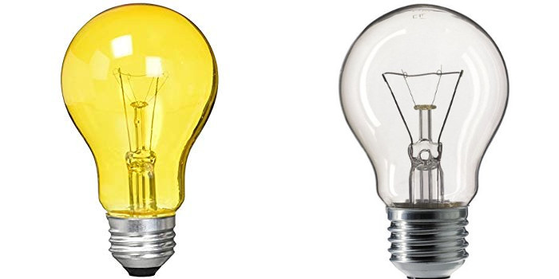
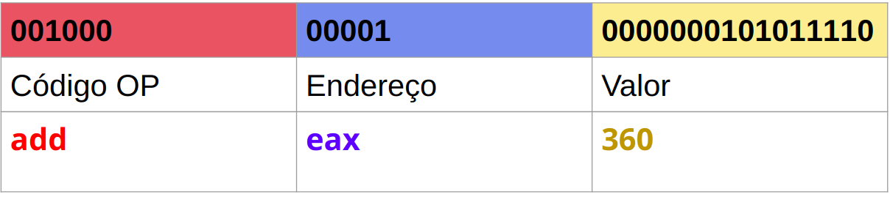
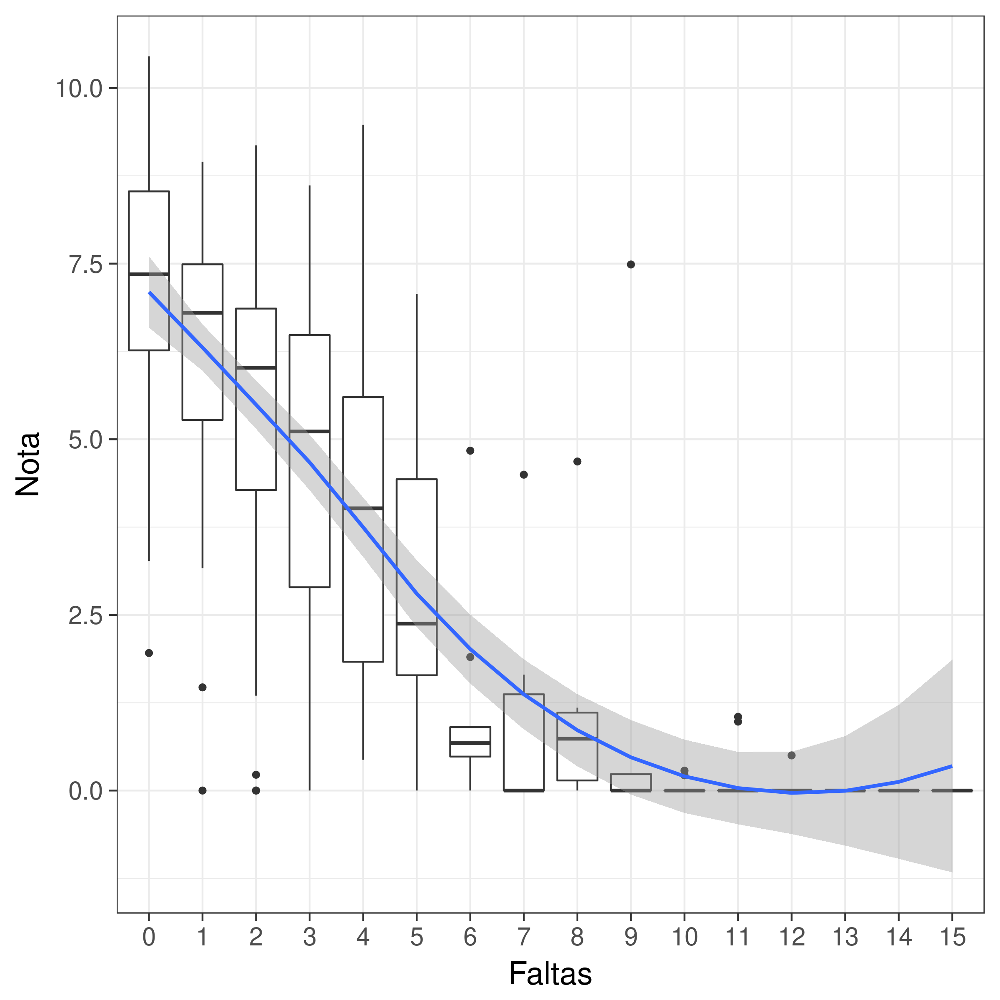

# Algoritmo e Programação

## Computação

**Computação** se refere a um cálculo, aritmético ou não, seguindo um modelo bem definido para a solução de um problema.

Não necessariamente utilizando um computador...

## Algoritmo

**Algoritmo** é a descrição de uma solução de um problema computável.

Seu nome vem de **al-Khwarizmi**, um dos percursores da algebra.

## Máximo Divisor Comum

O primeiro algoritmo que se tem conhecimento é o **Algoritmo de Euclides**, utilizado para calcular o **Máximo Divisor Comum**.

## Máximo Divisor Comum

Dados $a, b \in \mathbb{N}$:

```haskell
mdc(a, 0) = a
mdc(0, b) = b
mdc(a, b) = mdc(b, a%b)
```

**Definição:** $a, b$ são **argumentos** ou **entradas** de nosso algoritmo.

## Propriedades de um Algoritmo

Todo algoritmo deve possuir quatro propriedades para ser definido como tal:

1. Finitude
2. Desambiguidade
3. Conjunto de entrada
4. Conjunto de saída

## Finitude

Um algoritmo **SEMPRE** deve terminar em um período finito de tempo.

- Como o segundo argumento do algoritmo de Euclides sempre diminui, e por serem definidos para números naturais, eventualmente esse chegará a zero e terminará.

## Desambiguidade

Não pode haver ambiguidade em nenhuma das instruções do algoritmo.

- *Vá até a loja e compre duas caixas de leite, e se tiver ovos, compre seis*

- $1 + 2 * 3 = ??$

## Entrada

O algoritmo recebe um conjunto de entradas (argumentos) que pode ser vazio, finito ou infinito.

- No algoritmo de Euclides temos o conjunto de entradas $a, b \in \mathbb{N}^2$.

## Saída

O algoritmo deve produzir uma (ou mais) saída como resultado do processamento. Não faz sentido perguntarmos algo que não tenha uma resposta.

- No algoritmo de Euclides temos como resposta o máximo divisor comum $m \in \mathbb{N}$.

# Funções e Programas de Computador

## Os dois lados do algoritmo

A definição de **algoritmo** não é formalizada na área de Ciência da Computação. Ele é apenas uma abstração do pensamento computacional.

## Os dois lados do algoritmo

Por outro lado, temos dois conceitos formais que podem definir um algoritmo: **funções** e **programas de computador**.

## Funções

Uma **função** $f : X \rightarrow Y$ é um mapa de elementos do conjunto $X$ para elementos do conjunto $Y$.

$mdc : \mathbb{N}^{2} \rightarrow \mathbb{N}$

$dobra : \mathbb{N} \rightarrow \mathbb{N}$

## Tipos

Um **tipo** é um conjunto nomeado de valores que apresentam alguma propriedade comum.

**Exemplos:** $\mathbb{N}, \mathbb{Z}, \mathbb{R}, \{F, V\}, primos$

## Tipos

Vamos definir o tipo denominado **L** que representa o estado de uma lâmpada:

- L = {On, Off}

{ width=50% }

## Tipos

Imagine que em uma sala contendo uma lâmpada temos um *botão* que executa uma função que pode alterar o estado da lâmpada.

{ width=50% }

## Tipos

Podemos formalizar essa função como $f : L \rightarrow L$.

Como você imagina essa função? Quantas possíveis definições existem?

## Tipos

1. $f1(lamp) = On$ 
2. $f2(lamp) = Off$ 
3. $f3(lamp) = lamp$
4. $f4(lamp) = \begin{cases}On, & lamp=Off\\Off, & lamp=On\end{cases}$


## Tipos

Se pensarmos nos valores **verdadeiro** e **falso** substituindo os valores On/Off, o que cada função representa?

## Funções e Algoritmos

Podemos pensar em uma função como um algoritmo implementado na linguagem matemática.

O algoritmo $mdc$ é uma função!

## Programa de Computador

Um programa de computador é um conjunto de instruções de máquina que implementam um algoritmo.

Passo a passo de como o computador deve processar os dados.

## Programa de Computador

Internamente ele é definido por sequências de bits.

Cada sequência de bit é mapeada para uma instrução do processador.

## Programa de Computador



## Algoritmo MDC em Linguagem de Máquina

```asm
mov esi, 68    # m = 68
mov ebx, 119   # n = 119
jmp .L2        # vai para o passo 2

.L3:
    mov ebx, edx    # n = r
.L2:
    mov eax, ebx  
    idiv esi        # EAX = m / n (EAX), EDX = r
    mov esi, ebx    # m = n
    test  edx, edx  # verifica se o resto é zero
    jne .L3         # se teste anterior não zero,
                    # vai para L3
```

## Programação Imperativa

**Programação Imperativa** é o paradigma em que um programa de computador é definido como um passo a passo das tarefas que devem ser feitas para chegar ao resultado.

## Programação Imperativa

- É necessário detalhar toda a sequência de operação.
- Não existe reaproveitamento.
- Não existem tipos, todas as operações podem ser aplicadas em quaisquer dados.

## Problemas Complexos

**The Magical Number Seven, Plus or Minus Two: Some Limits on Our Capacity for Processing Information** - George A. Miller

## Problema Complexo = n Problemas Simples

Para resolver problemas complexos:

- Divida o problema em problemas menores.
- Resolva os problemas menores, um de cada vez.
- Junte as peças.

## Abstração

**Abstração** é a remoção de detalhes que não são importantes para a resolução de um problema.

## Abstração

*The purpose of abstraction is not to be vague, but to create a new semantic level in which one can be absolutely precise* - Edsger W. Dijkstra

## Abstração

- Precisamos saber calcular o resto da divisão para definir o algoritmo de Euler?
- É necessário implementar as instruções de soma e divisão para definir uma função de média?

## Abstração

A abstração remove trabalhos desnecessários (mas que alguém tem que fazer em algum momento).

## Linguagem de Alto Nível

As **linguagens de alto nível** permitem um nível de abstração maior que a linguagem de máquina. Com isso podemos descrever os programas sem necessidade de detalhar passo a passo cada instrução.

## Linguagem de Alto Nível

- Possui um conjunto de instruções próximas da linguagem natural.
- Minimiza o número de instruções para tarefas frequentes.
- Não requer completo entendimento do funcionamento do computador.

## Programação Procedural e Estruturada

Um nível maior de abstração permitiu a criação do paradigma procedural e estruturado em que cada bloco de instruções representa a solução de um problema menor.

## Programação Orientada a Objetos

Um nível ainda maior de abstração, esconde os detalhes dentro de objetos e cria uma interface de comunicação para realizar composição e processamento.

## Programação Funcional

Criado anteriormente a POO mas que está sendo incorporado às linguagens de outros paradigmas. Abstração escondida em funções puras e imutáveis. Particularmente interessante para compor pequenas funções em funções mais complexas.

## Dados

Uma tarefa comum na computação é a manipulação de **dados**:

- Que operações posso fazer com dois inteiros?
- Preciso calcular algumas medidas estatísticas de uma lista de valores numéricos.
- Quero recuperar o registro com os dados de um aluno.
- Vou inserir as notas de uma lista de alunos após o fim do quadrimestre.

## Estrutura de Dados

Para ser possível trabalhar com esses dados, é necessário criar uma estrutura que armazene as informações de forma organizada. Para isso criamos uma **Estrutura de Dados** que determina as especificações de um certo tipo.

## Objetivo do Curso

Ensinar as **Estrutura de Dados** mais básicas da computação de forma abstrata e concreta!

## Ferramentas

Para isso utilizaremos a **linguagem de programação C**.

## Algoritmo MDC em C

Nota: esse algoritmo não está implementado de forma eficiente!

```C
unsigned int mdc(unsigned int a, unsigned int b) 
{
    if(a==0) return b;
    if(b==0) return a;
    return mdc(b, a%b);
}
```

## Estrutura de Dados

- Representação dos Dados
- Suporte a operações básicas

## Tipo `L`

O nosso tipo `L` criado anteriormente pode ser representado com apenas *1 bit* de informação: $0$ representa desligado e $1$ representa ligado.

## Tipo `Int`

O tipo `int` geralmente é representado como uma sequência de $n$ bits [^atualmente o mais comum é $32$ bits] utilizando complemento de $2$ para valores negativos.

Esse tipo deve permitir as operações de *soma, subtração, multiplicação, divisão inteira, resto da divisão* dentre outras.

## Tipos Primitivos

Tipos básicos fornecidos pela linguagem:

- **Boolean**
- **Int**
- **Float**
- **Double**
- **Char**
- **Ponteiros**

## Tipos Compostos

Tipos que são formados pela combinação dos tipos primitivos:

- **Arranjo:** ou *array* na linguagem C, dados armazenados sequencialmente na memória.
- **Registro:** ou *struct* na linguagem C, *tupla* e *tipo produto* em outras linguagens, mistura de vários tipos.
- **Union:** ou *tipo soma* em outras linguagens, permite armazenar um dentre vários tipos pré-definidos.

## Array

```C
int x[10];

x[3] = 2;
printf("%d\n", *(x + 3));
```

## Struct

```C
struct dados_alunos {
   char nome[50];
   int ra;
   int cr;
}
```

## Union

```C
union desempenho {
    int cr;
    float normalizado;
};
```

## Tipos de Dados Abstratos

**Tipos de Dados Abstratos** (TDA) são abstrações de estrutura de dados que remove detalhes desnecessários de implementação.

Para inserir um elemento em uma lista, preciso saber o tipo que essa lista armazena?

## Tipos de Dados Abstratos

Independente de linguagem ou paradigma! Se minha linguagem suporta um tipo lista, eu sei que posso inserir um elemento, não preciso saber como ela faz isso.

## Tipo Racionais

Vamos criar um TDA para representar frações. Nosso tipo deve suportar as operações básicas de *soma, subtração, multiplicação e divisão*.

## Tipo Racionais

Para criar uma TDA devemos criar **definições** e **condições** para essas definições.

## Tipo Racionais

O tipo racional deve ter dois elementos: um numerador e um denominador.

## Tipo Racionais

```C
typedef struct racional {
    int num;
    int den;
} racional;
```

## Tipos Racionais

Um número racional não pode conter $0$ no denominador. Vamos criar uma *interface* para criar um racional:

```C
racional * cria_racional(int num, int den) {
    if (den==0) return NULL;

    racional * r = malloc(sizeof(racional));
    *r = (racional){num, den};

    return r;
}
```

## Tipos Racionais

Precisamos imprimir esse tipo:

```C
void print_racional(racional * r) {
  if (r == NULL) printf("Fração inválida\n");
  else printf("%d / %d\n", r->num, r->den);
}
```

## Tipos Racionais

A soma de duas frações é: 

$$\frac{a}{b} + \frac{c}{d} = \frac{a \cdot d + b \cdot c}{c \cdot d}$$

## Tipos Racionais

```C
racional * soma_racional(racional * r1, racional * r2) {
  int num, den;

  if (r1==NULL || r2==NULL) return NULL;

  den = r1->den * r2->den;
  num = r1->num * r2->den + r2->num * r1->den;

  return cria_racional(num, den);
}
```

## Tipos Racionais

A multiplicação de duas frações é:

$$\frac{a}{b} \times \frac{c}{d} = \frac{a \cdot b}{c \cdot d}$$

## Tipos Racionais

```C
racional * mult_racional(racional * r1, racional * r2) {
  int num, den;

  if (r1==NULL || r2==NULL) return NULL;

  num = r1->num * r2->num;
  den = r1->den * r2->den;
  
  return cria_racional(num, den);
}
```

## Tipos Racionais

Implemente a subtração e divisão!

## Metodologia

- 2 horas de aulas teóricas + 2 horas de aulas práticas
- Duas provas com valor $[0, 10]$
- Média final = média aritmética das notas.

## Metodologia

Nota - conceito:

```Haskell
conceito :: Double -> Char
conceito nota
  | nota >= 9 = 'A'
  | nota >= 8 = 'B'
  | nota >= 6 = 'C'
  | nota >= 5 = 'D'
  | otherwise = 'F'
```

## Recuperação

Prova sobre todo o conteúdo da matéria:

```Haskell
conceito :: Double -> Char
conceito nota
  | nota >= 7 = 'C'
  | nota >= 5 = 'D'
  | otherwise = 'F'
```

## Empenho x Desempenho

{width=60%}

## Site do Curso (teoria)

[Algoritmos e Estrutura de Dados I](https://folivetti.github.io/teaching/2019-summer-teaching-1)

## Livros Textos

Estrutura de Dados e seus algoritmos

Cormen T. H et al., “Algoritmos: Teoria e Prática”. Rio de Janeiro: Editora Campus, 2ª edição, 2002
Knuth D.E. “The Art of Computer Programming”. vols. 1 e 3, Addison-Wesley, 1973
Jayme Luiz Szwarcfiter et al., "Estruturas de Dados e Seus Algoritmos", 2010

## Próxima aula

Aprenderemos sobre como medir o custo de um algoritmo.
