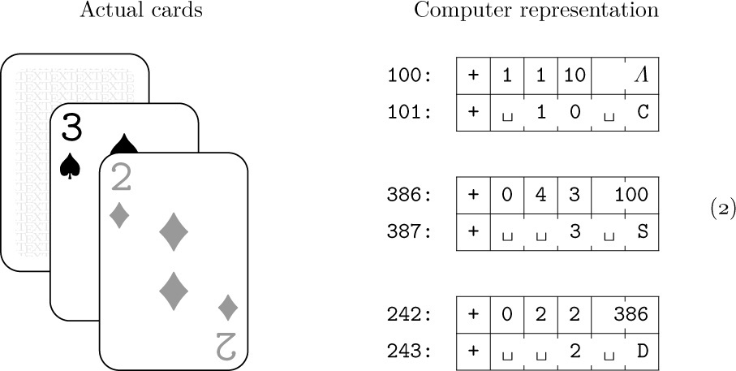
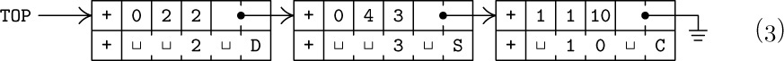
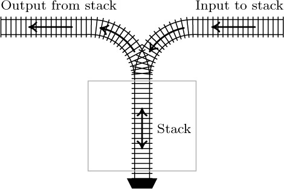
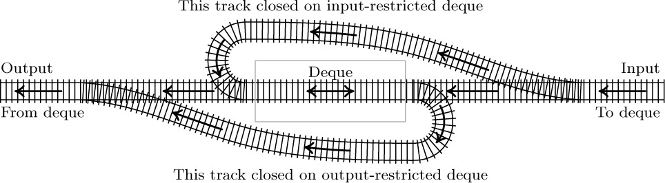

# Estrutura de Dados

## Estrutura de Dados

Muitos programas de computadores operam em tabelas de informação. Processamento de dados!

Essa informação geralmente é apresentada de forma estruturada e organizada.

## Estrutura de Dados

Uma possível estrutura simples é a lista linear de elementos. Ela responde as perguntas:

- Qual o primeiro elemento?
- Qual o último elemento?
- Qual o elemento anterior ou próximo desse elemento?
- Quantos elementos a lista possui?

Podemos extrair diversas outras informações dessa simples estrutura!

## Estrutura de Dados

Um exemplo de estrutura mais complexa é o nosso cérebro que possui múltiplas conexões entre seus elementos.

## Estrutura de Dados

**Estrutura de Dados** estuda as relações estruturais presentes nos dados e técnicas de representação e manipulação destes.

## Estruturas Lineares

**Estruturas Lineares** são estruturas de armazenamento sequencial.

# Tipos de Dados Algébricos

## Tipos de Dados

**Tipos** representam conjuntos de valores dentro de um contexto.

## Tipos de Dados

Alguns tipos básicos em C:

- **void:** habitado por apenas um único valor (que não pode ser utilizado explicitamente).
- **char:** habitado por $256$ valores representando caracteres da tabela ASCII.
- **int:** habitado por $2^{32}$ valores quando utiliza $4$ bytes.

# Tipos Compostos

## Tipo Produto

O **Tipo Produto** combina dois ou mais tipos em uma tupla de tipos. Em C é criado utilizando `struct`:

```C
struct ponto {
    double x;
    double y;
};
```

## Tipo Soma

O **Tipo Soma** cria uma escolha entre tipos ou valores. Em C isso é feito utilizando `enum` ou `union`:

```C
enum dia_semana {DOM, SEG, TER, QUA, QUI, SEX, SAB};

int eh_folga(int dia) {
  switch(dia) {
    case DOM:
    case SAB:
      return 1;
    default: return 0;
  }
}
```

## Tipo Soma

```C
struct int_ou_double {
    char eh_int;
    union valor {
        int x;
        double y;
    }
};
```

## Registro

Em tabelas de informação, cada elemento é denominado **registro** e é representado em C por uma `struct` (combinada com `enum` e `union`):

```C
enum suits {CLUBS, DIAMONDS, HEARTS, SPADES};
struct carta {
    char tag; // 0 - virada para cima, 1 - virada para baixo
    int suit; 
    unsigned int rank; // valor numerico
    struct carta * next;
    char name[10];
};
```

## Registro



## Registro



Reparem que temos um elemento recursivo na estrutura (`next`) que aponta para uma próxima carta. Essa ligação é importante para muitas estruturas que estudaremos adiante.

# Tipos de Dados Abstratos

## Tipos de Dados Abstratos

Um **Tipo de Dado Abstrato** é a descrição de uma estrutura de forma abstrata juntamente com as funções que devem ser implementadas para ela.

## Tipos de Dados Abstratos

Nesse contexto **abstrato** significa que devemos descrever apenas os detalhes básicos da estrutura. Note que não descrevemos muitos aspectos da estrutura carta.

# Listas Lineares

## Listas Lineares

Listas lineares são sequências de $n \geq 0$ elementos denotados por $x_0, x_1, \ldots, x_{n-1}$ com índice iniciando em $0$.

## Listas Lineares

A propriedade fundamental dessa estrutura é a relação entre posições relativas dos elementos em uma linha.

## Listas Lineares

O que nos interessa para essa estrutura é que se $n > 0$, $x_0$ é o primeiro elemento e $x_{n-1}$ é o último e, se $0 < k < n-1$, $x_{k-1}$ precede $x_k$ e e$x_{k+1}$ sucede $x_k$.

## Listas Lineares

As listas lineares possuem diversas operações associadas:

1. Acessar ou alterar o $k$-ésimo elemento
2. Inserir um novo registro antes ou após a posição $k$
3. Apagar o $k$-ésimo registro
4. Combinar duas listas lineares
5. Dividir uma lista em duas
6. Copiar uma lista
7. Determinar quantidade de registros
8. Ordenar os elementos em ordem crescente de acordo com um dos campos dos registros
9. Buscar um elemento da lista de acordo com um campo dos registros

## Listas Lineares

As operações 1, 2 e 3 são interessantes pois podem ser mais ou menos custosas dependendo da estrutura utilizada. Além disso temos os casos especiais em que $k=0$ e $k = n-1$.

## Listas Lineares

Nem todas as operações são sempre necessárias em um programa, e nenhuma estrutura possui desempenho ótimo para todas elas.

## Listas Lineares

Portanto, as estruturas são classificadas de acordo com as operações em que elas possuem melhor desempenho.

- **Pilha (stack):** acesso, inserção e remoção de elementos sempre no final da lista. First-In Last-Out (FILO)
- **Fila (queue):** inserção no final da lista, acesso e remoção no começo da lista. First-In First-Out (FIFO)
- **Deque (double-ended queue):** acesso, inserção e remoção tanto no começo como no final da lista.

## Listas Lineares



## Listas Lineares



# Listas com alocação sequencial

## Alocação Sequencial

Forma simples e natural de representação, arrays em C: registros armazenados em segmentos sequenciais de memória.

```C
struct s x;
c = sizeof(struct s);
x[j] = *(x + c*j);
```

## Pilha

A **pilha** implementada em alocação sequencial possui uma capacidade máxima pré-fixada e consiste de uma array com $n$ elementos e um apontador para o topo da pilha:

```C
#define STACK_TYPE int
#define CAPACITY 100

typedef struct stack {
    STACK_TYPE data[CAPACITY];
    int top;
} stack;
```

## Pilha

Inicialmente a pilha não possui elementos e o campo `top` aponta para lugar algum, representado por $-1$:

```C
stack create_stack() {
  stack p;
  p.top = -1;
  return p;
}
```

## Pilha

Essa estrutura possui apenas duas operações fundamentais:

- `push`: insere um elemento no topo da pilha.
- `pop`: remove um elemento do topo da pilha.

## Pilha

```C
stack * push(stack * p, STACK_TYPE x) {
  if (p->top + 1 < CAPACITY)
  {
    ++p->top;
    p->data[p->top] = x;
    return p;
  } else return NULL;
}
```

## Pilha

```C
STACK_TYPE * pop(stack * p) {
    if (p->top == -1) return NULL;
    --p->top;
    return &(p->data[p->top + 1]);
}
```

## Pilha

Exemplo de uso:

```C
...
int i;
STACK_TYPE * x;
stack p = create_stack();
for (i = 0; i < 10; i++){
   if (push(&p, i) == NULL) {
       printf("ERRO! ESTOURO DE PILHA!\n");
   }
}

while( (x = pop(&p)) != NULL ) {
    printf("%d\n", x);
}
```

## Pilha

\begin{tikzpicture}[font=\ttfamily,
array/.style={matrix of nodes,nodes={draw, minimum size=7mm, fill=green!30},column sep=-\pgflinewidth, row sep=0.5mm, nodes in empty cells,
row 1 column 1/.style={nodes={draw}}},ampersand replacement=\&]
  \matrix[array] (array)  {
            \\
             \\
             \\
             \\
             \\
            -1 \\
};
\node[right=of array-6-1] (top) {top};

\draw[->] (top) -- (array-6-1);

\end{tikzpicture}

## Pilha

`push(&p, 1);`

\begin{tikzpicture}[font=\ttfamily,
array/.style={matrix of nodes,nodes={draw, minimum size=7mm, fill=green!30},column sep=-\pgflinewidth, row sep=0.5mm, nodes in empty cells,
row 1 column 1/.style={nodes={draw}}},ampersand replacement=\&]
  \matrix[array] (array)  {
            \\
             \\
             \\
             \\
            1 \\
            -1 \\
};
\node[right=of array-5-1] (top) {top};

\draw[->] (top) -- (array-5-1);

\end{tikzpicture}

## Pilha

`push(&p, 2);`

\begin{tikzpicture}[font=\ttfamily,
array/.style={matrix of nodes,nodes={draw, minimum size=7mm, fill=green!30},column sep=-\pgflinewidth, row sep=0.5mm, nodes in empty cells,
row 1 column 1/.style={nodes={draw}}},ampersand replacement=\&]
  \matrix[array] (array)  {
            \\
             \\
             \\
            2 \\
            1 \\
            -1 \\
};
\node[right=of array-4-1] (top) {top};

\draw[->] (top) -- (array-4-1);

\end{tikzpicture}

## Pilha

`push(&p, 3);`

\begin{tikzpicture}[font=\ttfamily,
array/.style={matrix of nodes,nodes={draw, minimum size=7mm, fill=green!30},column sep=-\pgflinewidth, row sep=0.5mm, nodes in empty cells,
row 1 column 1/.style={nodes={draw}}},ampersand replacement=\&]
  \matrix[array] (array)  {
            \\
             \\
            3 \\
            2 \\
            1 \\
            -1 \\
};
\node[right=of array-3-1] (top) {top};

\draw[->] (top) -- (array-3-1);

\end{tikzpicture}

## Pilha

`push(&p, 4);`

\begin{tikzpicture}[font=\ttfamily,
array/.style={matrix of nodes,nodes={draw, minimum size=7mm, fill=green!30},column sep=-\pgflinewidth, row sep=0.5mm, nodes in empty cells,
row 1 column 1/.style={nodes={draw}}},ampersand replacement=\&]
  \matrix[array] (array)  {
            \\
            4 \\
            3 \\
            2 \\
            1 \\
            -1 \\
};
\node[right=of array-2-1] (top) {top};

\draw[->] (top) -- (array-2-1);

\end{tikzpicture}

## Pilha

`pop(&p);`

\begin{tikzpicture}[font=\ttfamily,
array/.style={matrix of nodes,nodes={draw, minimum size=7mm, fill=green!30},column sep=-\pgflinewidth, row sep=0.5mm, nodes in empty cells,
row 1 column 1/.style={nodes={draw}}},ampersand replacement=\&]
  \matrix[array] (array)  {
            \\
             \\
            3 \\
            2 \\
            1 \\
            -1 \\
};
\node[right=of array-3-1] (top) {top};

\draw[->] (top) -- (array-3-1);

\end{tikzpicture}

## Pilha

`pop(&p);`

\begin{tikzpicture}[font=\ttfamily,
array/.style={matrix of nodes,nodes={draw, minimum size=7mm, fill=green!30},column sep=-\pgflinewidth, row sep=0.5mm, nodes in empty cells,
row 1 column 1/.style={nodes={draw}}},ampersand replacement=\&]
  \matrix[array] (array)  {
            \\
             \\
             \\
            2 \\
            1 \\
            -1 \\
};
\node[right=of array-4-1] (top) {top};

\draw[->] (top) -- (array-4-1);

\end{tikzpicture}

## Pilha

`pop(&p);`

\begin{tikzpicture}[font=\ttfamily,
array/.style={matrix of nodes,nodes={draw, minimum size=7mm, fill=green!30},column sep=-\pgflinewidth, row sep=0.5mm, nodes in empty cells,
row 1 column 1/.style={nodes={draw}}},ampersand replacement=\&]
  \matrix[array] (array)  {
            \\
             \\
             \\
             \\
            1 \\
            -1 \\
};
\node[right=of array-5-1] (top) {top};

\draw[->] (top) -- (array-5-1);

\end{tikzpicture}

## Pilha

Notem que por termos uma capacidade pré-definida as operações `push, pop` da pilha devem tomar o cuidado de não realizar operações inválidas.

## Pilha

A tentativa de inserir um registro além da capacidade de uma estrutura causa o *overflow*, a tentativa de remover um registro de uma estrutura vazia causa o *underflow*.

## Pilha

Essas duas condições são tratadas no código retornando NULL, representando falha na operação.

## Pilha

Nas pilhas, as operações 1, 2 e 3 ocorrem apenas no elemento $n-1$. 

## Pilha

As operações 4, 5, 8 e 9, embora possíveis de serem implementadas, não fazem parte do conjunto de operações em pilhas. Para essas operações outras estruturas são mais interessantes.

## Pilha

O tamanho da pilha (operação 7) é facilmente recuperado pelo campo `top`:

```C
int size_stack(stack p) {
  return p.top + 1;
}
```

## Pilha

Finalmente, a cópia de uma pilha (operação 6) é uma simples cópia da estrutura:

```C
stack copy_stack(stack p) {
  stack new_p;
  new_p.top = p.top;
  memcpy(new_p.data, p.data, 
         sizeof(STACK_TYPE)*CAPACITY);
  return new_p;
}
```

## Fila

A **Fila** em uma estrutura sequencial é similar a pilha, porém temos dois apontadores, um para o começo e outro para o final da fila:

```C
typedef struct queue {
    QUEUE_TYPE data[CAPACITY];
    int front;
    int back;
} queue;
```

## Fila

A inicialização de uma fila define os apontadores como $-1$, sinalizando fila vazia:

```C
queue create_queue() {
  queue p;
  p.front = p.back = -1;
  return p;
}
```

## Fila

\begin{tikzpicture}[font=\ttfamily,
array/.style={matrix of nodes,nodes={draw, minimum size=7mm, fill=green!30},column sep=-\pgflinewidth, row sep=0.5mm, nodes in empty cells,
row 1/.style={nodes={draw=none, fill=none, minimum size=5mm}},
row 1 column 1/.style={nodes={draw}}},ampersand replacement=\&]

\matrix[array] (array) {
-1 \&0 \& 1 \& 2 \& 3 \& 4 \& 5 \& 6 \& 7 \& 8 \& 9\\
   \&  \&   \&   \&   \&   \&   \&   \&   \&   \&  \\};

\begin{scope}[on background layer]
\fill[green!10] (array-1-1.north west) rectangle (array-1-11.south east);
\end{scope}

\draw (array-1-1.north)--++(90:3mm) node [above] (first) {front, back};

\end{tikzpicture}

## Fila

Para inserir um elemento na fila, apontamos o campo `back` para uma posição adiante e inserimos o novo registro nessa posição.

```C
queue * push(queue * p, QUEUE_TYPE x) {
  if ( p->back + 1 >= CAPACITY ) return NULL;

  if (p->front==-1) p->front=0;
  p->back = p->back + 1;
  p->data[p->back] = x;
  return p;
}
```

## Fila

`push(&p, 1);`

\begin{tikzpicture}[font=\ttfamily,
array/.style={matrix of nodes,nodes={draw, minimum size=7mm, fill=green!30},column sep=-\pgflinewidth, row sep=0.5mm, nodes in empty cells,
row 1/.style={nodes={draw=none, fill=none, minimum size=5mm}},
row 1 column 1/.style={nodes={draw}}},ampersand replacement=\&]

\matrix[array] (array) {
-1 \&0 \& 1 \& 2 \& 3 \& 4 \& 5 \& 6 \& 7 \& 8 \& 9\\
   \&1  \&   \&   \&   \&   \&   \&   \&   \&   \&  \\};

\begin{scope}[on background layer]
\fill[green!10] (array-1-1.north west) rectangle (array-1-11.south east);
\end{scope}

\draw (array-1-2.north)--++(90:3mm) node [above] (first) {front, back};

\end{tikzpicture}

## Fila

`push(&p, 2);`

\begin{tikzpicture}[font=\ttfamily,
array/.style={matrix of nodes,nodes={draw, minimum size=7mm, fill=green!30},column sep=-\pgflinewidth, row sep=0.5mm, nodes in empty cells,
row 1/.style={nodes={draw=none, fill=none, minimum size=5mm}},
row 1 column 1/.style={nodes={draw}}},ampersand replacement=\&]

\matrix[array] (array) {
-1 \&0 \& 1 \& 2 \& 3 \& 4 \& 5 \& 6 \& 7 \& 8 \& 9\\
   \&1  \&2   \&   \&   \&   \&   \&   \&   \&   \&  \\};

\begin{scope}[on background layer]
\fill[green!10] (array-1-1.north west) rectangle (array-1-11.south east);
\end{scope}

\draw (array-1-2.north)--++(90:3mm) node [above] (first) {front};
\draw (array-1-3.north)--++(90:3mm) node [above] (first) {back};

\end{tikzpicture}

## Fila

`push(&p, 3);`

\begin{tikzpicture}[font=\ttfamily,
array/.style={matrix of nodes,nodes={draw, minimum size=7mm, fill=green!30},column sep=-\pgflinewidth, row sep=0.5mm, nodes in empty cells,
row 1/.style={nodes={draw=none, fill=none, minimum size=5mm}},
row 1 column 1/.style={nodes={draw}}},ampersand replacement=\&]

\matrix[array] (array) {
-1 \&0 \& 1 \& 2 \& 3 \& 4 \& 5 \& 6 \& 7 \& 8 \& 9\\
   \&1  \&2   \& 3  \&   \&   \&   \&   \&   \&   \&  \\};

\begin{scope}[on background layer]
\fill[green!10] (array-1-1.north west) rectangle (array-1-11.south east);
\end{scope}

\draw (array-1-2.north)--++(90:3mm) node [above] (first) {front};
\draw (array-1-4.north)--++(90:3mm) node [above] (first) {back};

\end{tikzpicture}

## Fila

`push(&p, 4);`

\begin{tikzpicture}[font=\ttfamily,
array/.style={matrix of nodes,nodes={draw, minimum size=7mm, fill=green!30},column sep=-\pgflinewidth, row sep=0.5mm, nodes in empty cells,
row 1/.style={nodes={draw=none, fill=none, minimum size=5mm}},
row 1 column 1/.style={nodes={draw}}},ampersand replacement=\&]

\matrix[array] (array) {
-1 \&0 \& 1 \& 2 \& 3 \& 4 \& 5 \& 6 \& 7 \& 8 \& 9\\
   \&1  \&2   \& 3  \&4   \&   \&   \&   \&   \&   \&  \\};

\begin{scope}[on background layer]
\fill[green!10] (array-1-1.north west) rectangle (array-1-11.south east);
\end{scope}

\draw (array-1-2.north)--++(90:3mm) node [above] (first) {front};
\draw (array-1-5.north)--++(90:3mm) node [above] (first) {back};

\end{tikzpicture}

## Fila

A remoção de um elemento simplesmente move o campo `front` um passo adiante.

```C
QUEUE_TYPE * pop(queue * p) {
    int f = p->front;

    if (f == -1) return NULL;

    if (p->front==p->back) p->front=p->back=-1;
    else p->front = p->front + 1;
    return &(p->data[f]);
}

```

## Fila

`pop(&p);`

\begin{tikzpicture}[font=\ttfamily,
array/.style={matrix of nodes,nodes={draw, minimum size=7mm, fill=green!30},column sep=-\pgflinewidth, row sep=0.5mm, nodes in empty cells,
row 1/.style={nodes={draw=none, fill=none, minimum size=5mm}},
row 1 column 1/.style={nodes={draw}}},ampersand replacement=\&]

\matrix[array] (array) {
-1 \&0 \& 1 \& 2 \& 3 \& 4 \& 5 \& 6 \& 7 \& 8 \& 9\\
   \&  \&2   \& 3  \&4   \&   \&   \&   \&   \&   \&  \\};

\begin{scope}[on background layer]
\fill[green!10] (array-1-1.north west) rectangle (array-1-11.south east);
\end{scope}

\draw (array-1-3.north)--++(90:3mm) node [above] (first) {front};
\draw (array-1-5.north)--++(90:3mm) node [above] (first) {back};

\end{tikzpicture}

## Fila

`pop(&p);`

\begin{tikzpicture}[font=\ttfamily,
array/.style={matrix of nodes,nodes={draw, minimum size=7mm, fill=green!30},column sep=-\pgflinewidth, row sep=0.5mm, nodes in empty cells,
row 1/.style={nodes={draw=none, fill=none, minimum size=5mm}},
row 1 column 1/.style={nodes={draw}}},ampersand replacement=\&]

\matrix[array] (array) {
-1 \&0 \& 1 \& 2 \& 3 \& 4 \& 5 \& 6 \& 7 \& 8 \& 9\\
   \&  \&   \& 3  \&4   \&   \&   \&   \&   \&   \&  \\};

\begin{scope}[on background layer]
\fill[green!10] (array-1-1.north west) rectangle (array-1-11.south east);
\end{scope}

\draw (array-1-4.north)--++(90:3mm) node [above] (first) {front};
\draw (array-1-5.north)--++(90:3mm) node [above] (first) {back};

\end{tikzpicture}

## Fila

Um problema com essa implementação é que a cada elemento removido, a fila perde a capacidade em uma unidade. A área em cinza não poderá mais ser utilizada!

\begin{tikzpicture}[font=\ttfamily,
array/.style={matrix of nodes,nodes={draw, minimum size=7mm, fill=green!30},column sep=-\pgflinewidth, row sep=0.5mm, nodes in empty cells,
row 1/.style={nodes={draw=none, fill=none, minimum size=5mm}},
row 1 column 1/.style={nodes={draw}}},ampersand replacement=\&]

\matrix[array] (array) {
-1 \&0 \& 1 \& 2 \& 3 \& 4 \& 5 \& 6 \& 7 \& 8 \& 9\\
   \&  \&   \& 3  \&4   \&   \&   \&   \&   \&   \&  \\};

\begin{scope}[on background layer]
\fill[green!10] (array-1-1.north west) rectangle (array-1-11.south east);
\end{scope}
\fill[gray!10]  (array-2-2.north west) rectangle (array-2-3.south east);

\draw (array-1-4.north)--++(90:3mm) node [above] (first) {front};
\draw (array-1-5.north)--++(90:3mm) node [above] (first) {back};

\end{tikzpicture}

## Fila

Para resolver esse problema, podemos definir o movimento dos ponteiros como circular:

```C
queue * push(queue * p, QUEUE_TYPE x) {
  if ( (p->back + 1)%CAPACITY == p->front) return NULL;

  if (p->front==-1) p->front=0;
  p->back = (p->back + 1)%CAPACITY;
  p->data[p->back] = x;
  return p;
}
```

## Fila

```C
QUEUE_TYPE * pop(queue * p) {
    int f = p->front;

    if (f == -1) return NULL;

    if (p->front==p->back) p->front=p->back=-1;
    else p->front = (p->front + 1)%CAPACITY;
    return &(p->data[f]);
}
```

## Fila


\begin{tikzpicture}[font=\ttfamily,
array/.style={matrix of nodes,nodes={draw, minimum size=7mm, fill=green!30},column sep=-\pgflinewidth, row sep=0.5mm, nodes in empty cells,
row 1/.style={nodes={draw=none, fill=none, minimum size=5mm}},
row 1 column 1/.style={nodes={draw}}},ampersand replacement=\&]

\matrix[array] (array) {
-1 \&0 \& 1 \& 2 \& 3 \& 4 \& 5 \& 6 \& 7 \& 8 \& 9\\
   \&11  \&   \& 3  \&4   \&5   \&6   \&7   \&8   \&9   \&10  \\};

\begin{scope}[on background layer]
\fill[green!10] (array-1-1.north west) rectangle (array-1-11.south east);
\end{scope}

\draw (array-1-4.north)--++(90:3mm) node [above] (first) {front};
\draw (array-1-2.north)--++(90:3mm) node [above] (first) {back};

\end{tikzpicture}

## Próxima Aula

Aprenderemos sobre a alocação por **lista ligada**.
