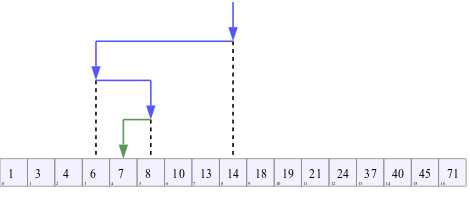
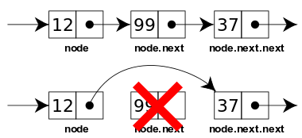

# Operações de Busca em Listas

## Busca de um elemento

Uma operação frequente em algoritmos que lidam com conjuntos de registros é a busca.

## Busca de um elemento

A busca por um registro pode ser necessário para:

- Encontrar o registro de um cliente
- Retornar um subconjunto de páginas web de acordo com uma chave

## Busca Sequencial

Dada uma lista alocada sequencialmente com $n$ elementos:

```C
int x[N] = { ... };
```

## Busca Sequencial

\begin{tikzpicture}[ampersand replacement=\&,font=\ttfamily,
array/.style={matrix of nodes,nodes={draw, minimum size=7mm, fill=green!30},column sep=-\pgflinewidth, row sep=0.5mm}, nodes in empty cells,
row 1/.style={nodes={draw=none, fill=none, minimum size=5mm}}]

\matrix[array] (array) {
 0 \& 1 \& 2 \& 3 \& 4 \& 5 \& 6 \& 7 \& 8 \& 9\\
 1  \& 2   \& 3  \&4   \&5   \&6   \&7   \&8   \&9   \&10  \\};

\begin{scope}[on background layer]
\fill[green!10] (array-1-1.north west) rectangle (array-1-10.south east);
\end{scope}

\end{tikzpicture}

## Busca Sequencial

Na busca sequencial, percorremos os elementos da lista até encontrar o valor que buscamos ou atingimos o final da array. Simples assim!

## Busca Sequencial

```C
int * busca_seq (int k, int * x, int n) {
  for (int i=0; i<n; i++)
  {
    if (k == x[i]) return &x[i];
  }
  return NULL;
}
```

## Busca Sequencial

A complexidade assintótica desse algoritmo é $O(n)$, e o custo de operações é:

$1 + (C+1-S) + (C-S) + C + S + (1-S) = 3 + 3C- 2S$

Sendo $C$ a quantidade de comparações feita e $S=1$ se a busca for bem sucedida.

## Busca Sequencial

Se reservarmos o índice $n$ da lista para guardar a chave, podemos economizar algumas operações:

```C
int * busca_seq (int k, int * x, int n) {
  int i = 0;
  x[n] = k;
  
  while (x[i] != k) i++;
  if (i<n) return &x[i];
  return NULL;
}
```

## Busca Sequencial

Na primeira versão comparavamos `i<n` e `k == x[i]` em todas as iterações, agora somente comparamos `x[i] != k`.

$1 + 1 + C + C + 1 + (1 + S) + (1 - S) = 4 + 2C$

## Busca Sequencial em Listas Ordenadas

Quando temos a garantia de que os elementos estão ordenados, podemos otimizar nosso código ainda mais!

O que você alteraria na versão 1 de nosso algoritmo?

## Busca Sequencial em Listas Ordenadas

```C
int * busca_seq (int k, int * x, int n) {
  for (int i=0; i<n && x[i] <= k; i++)
  {
    if (k == x[i]) return &x[i];
  }
  return NULL;
}
```

Mas podemos fazer ainda melhor...

## Busca Binária

Sabendo que nossa lista está ordenada, exceto se tivermos algum conhecimento sobre os registros, a melhor aposta é testar o elemento central.

## Busca Binária

\begin{tikzpicture}[ampersand replacement=\&,font=\ttfamily,
array/.style={matrix of nodes,nodes={draw, minimum size=7mm, fill=green!30},column sep=-\pgflinewidth, row sep=0.5mm}, nodes in empty cells,
row 1/.style={nodes={draw=none, fill=none, minimum size=5mm}}]

\matrix[array] (array) {
 0 \& 1 \& 2 \& 3 \& 4 \& 5 \& 6 \& 7 \& 8 \& 9\\
 1  \& 2   \& 3  \&4   \&5   \&6   \&7   \&8   \&9   \&10  \\};

\begin{scope}[on background layer]
\fill[green!10] (array-1-1.north west) rectangle (array-1-10.south east);
\end{scope}

\fill[red!10] (array-2-5.north west) rectangle (array-2-5.south east);

\end{tikzpicture}

## Busca Binária

Essa primeira comparação pode resultar em:

1. `x[i] == k`
2. `x[i] > k`
3. `x[i] < k`

## Busca Binária

O primeiro caso resulta em um retorno bem sucedido da busca e nada mais a fazer.

## Busca Binária

Nos outros dois casos, podemos inferir que:

2. `x` deve estar antes da posição `i`
3. `x` deve estar após a posição `i`

## Busca Binária

Com isso podemos definir um novo intervalo de busca, inicialmente em $[0,n-1]$ e agora em:

2. $[0, i-1]$
3. $[i+1, n-1]$

repetimos até ou encontrar o elemento ou deduzir que ele não existe!

## Busca Binária



## Busca Binária

```C
int * busca_bin (int k, int * x, int n) {
  int left = 0, right = n-1;
  int mid = (left+right)/2;

  while (x[mid] != k)
  {
    if (x[mid] > k) right = mid-1;
    else left = mid+1;

    mid = (left+right)/2;
    if (left > right) return NULL;
  }
  return &x[mid];
}
```

## Busca Binária

A cada passo do algoritmo, nosso espaço de busca é reduzido pela metade. Então para uma lista de tamanho $n$, um caso não sucedido pode ser executado como:

$[1,n]$

$[1, n/2]$

$[1, n/4]$

$\ldots$

## Busca Binária

Supondo $n = 2^m$, ele chegará ao final em $m$ passos (cada passo divide o intervalo por $2$ e reduz $m$ em $1$).

Portanto temos que:

$\lg n = \lg 2^m$

$\lg n = m \cdot \lg 2$

$\lg n = m$

E temos que a análise assintótica para essa busca é $O(\log n)$.

## Busca Interpolação

Se além de assumir que a lista está ordenada, mas também uniformemente distribuída, podemos otimizar o algoritmo ainda mais.

## Busca Interpolação

Como vocês fazem a busca em um dicionário ou uma agenda telefônica (se ainda fazem)?

## Busca Interpolação

Se o nome começa com a letra **C**, não começaremos da metade, mas sim de uma posição aproximada, mais para o começo da lista.

## Busca Interpolação

Esse algoritmo tem apenas duas diferenças em relação a busca binária. O cálculo da variável `mid` se torna:

$mid = left + \frac{(k - x_{left})*(right-left)}{x_{right} - x_{left}}$

Que remete a interpolação de uma reta, tendo dois pontos de base:

$\frac{x' - x_0}{x_1 - x_0} = \frac{y' - y_0}{y_1 - y_0}$

## Busca Interpolação

```C
int * busca_interp (int k, int * x, int n) {
  int l = 0, r = n-1;
  int mid = l + ((k - x[l])*(r-l)/(x[r]-x[l]));

  while (x[mid] != k)
  {
    mid = l + ((k - x[l])*(r-l)/(x[r]-x[l]));
    if (x[mid] > k) r = mid-1;
    else l = mid+1;

    if ((x[l] > k) || (x[r] < k)) return NULL;
  }
  return &x[mid];
}
```

## Busca Interpolação

Esse algoritmo possui uma complexidade assintótica $O(\log \log n)$, sendo mais rápido que a busca binária nesses casos em que a distribuição dos valores é próxima a uniforme.

# Listas Ligadas

## Listas Ligadas

Uma outra forma de criar uma lista linear é através de uma estrutura ligada em que a lista cresce dinamicamente conforme os registros são inseridos ou removidos.

## Listas Ligadas

Em uma lista ligada cada registro possui um campo extra declarado como um ponteiro para o próximo registro da lista:

```C
typedef struct info {
  int chave;
  struct info * prox;
} info;
```

## Listas Ligadas

Dessa forma o endereço do próximo elemento não pode mais ser calculado por sua posição:

| Endereço | Valor |
|----------|-------|
|$L_0 + 0$ |  $x_0$|
|$L_0 + 1$ |  $x_1$|
|$L_0 + 2$ |  $x_2$|
|$L_0 + 3$ |  $x_3$|

## Listas Ligadas

Dessa forma o endereço do próximo elemento não pode mais ser calculado por sua posição:

| Endereço | Valor      |
|----------|------------|
| A        | $(x_0, B)$ |
| B        | $(x_0, C)$ |
| C        | $(x_0, D)$ |
| D        | $(x_0, \Lambda)$ |

## Listas Ligadas

Durante todo o programa, após a criação da lista ligada, devemos manter um ponteiro para o primeiro elemento da lista.

## Listas Ligadas

O último elemento da lista é sinalizado com o campo `prox == NULL`.

## Listas Ligadas

\begin{tikzpicture}[list/.style={rectangle split, rectangle split parts=2,
    draw, rectangle split horizontal}, >=stealth, start chain]

  \node[list,on chain] (A) {12};
  \node[list,on chain] (B) {99};
  \node[list,on chain] (C) {37};
  \node[on chain,draw,inner sep=6pt] (D) {};
  \draw (D.north east) -- (D.south west);
  \draw (D.north west) -- (D.south east);
  \draw[*->] let \p1 = (A.two), \p2 = (A.center) in (\x1,\y2) -- (B);
  \draw[*->] let \p1 = (B.two), \p2 = (B.center) in (\x1,\y2) -- (C);
  \draw[*->] let \p1 = (C.two), \p2 = (C.center) in (\x1,\y2) -- (D);
\end{tikzpicture}

## Listas Ligadas

Para criar um elemento da lista ligada devemos alocar o espaço na memória e inicializar a variável:

```C
info * cria_info (int x) {
  info * p = malloc(sizeof(info));
  p->x = x;
  p->prox = NULL;
  return p;
}
```

## Listas Ligadas

Para inserir um novo item após determinada posição, basta atualizar os ponteiros.


## Listas Ligadas

```C
info * p2_apos_p1(info * p1, info * p2) {
  p2->prox = p1->prox;
  p1->prox = p2;
  return p1;
}
```

## Listas Ligadas

Assim como na inserção, a remoção é apenas atualização de ponteiros.



## Listas Ligadas

```C
info * remove_prox(info * p) {
  info * p_tmp;
  if (p==NULL || p->prox == NULL) return p;
  p_tmp = p->prox;
  p->prox = p->prox->prox;
  free(p_tmp);
  return p;
}
```

## Listas Ligadas

Para inserir um novo item no final da lista, devemos andar até o fim e inserir o elemento com o procedimento anterior:

```C
info * insere_fim(info * p, int x) {
  info * new_p = cria_info(x);
  info * w = p;

  if (p==NULL) return new_p;

  while(w->prox != NULL) w = w->prox;
  p2_apos_p1(w, new_p);
  
  return p;
}
```

## Listas Ligadas

Para transformar essa lista em uma pilha, basta implementar a função `pop`:

```C
info * pop_ll_pilha(info * p) {
  info * w = p;
  intfo * tmp;

  if (p==NULL) return p;
  if (p->prox == NULL) return p;

  while (w->prox->prox != NULL) w=w->prox;
  tmp = w->prox;
  w->prox = NULL;
  return tmp;
}
```

Essa função tem um erro...qual é?

## Listas Ligadas

Para o caso em que temos apenas um elemento, a pilha não fica vazia (`=NULL`). Resolvemos isso fazendo com que a função retorne o elemento e o novo apontador para o começo da lista.

Mas C não retorna mais do que um elemento...

## Listas Ligadas

Vamos criar uma estrutura de pares:

```C
typedef struct pair {
  struct info * x;
  struct info * p;
} pair;
```

## Listas Ligadas

```C
pair pop_ll_pilha(info * p) {
  info * w = p;
  pair result = (pair){NULL, p};

  if (p==NULL) return (pair){NULL, NULL};
  if (p->prox == NULL) return (pair){p, NULL};

  while (w->prox->prox != NULL) w=w->prox;
  result.x = w->prox;
  w->prox = NULL;
  return result;
}
```

## Listas Ligadas

Devemos tomar o cuidado de atualizar os apontadores:

```C
result = pop_ll_pilha(p);
p = result.p;
```

## Listas Ligadas

Mantemos a inserção e remoção no final da pilha, porém fazer essas operações no início é menos custosa (e menos trabalhosa de implementar).

Exercício: implemente `push` e `pop` para inserir e remover no começo da lista ligada.

## Listas Ligadas

A função `pop` para a fila é mais simples:

```C
pair pop_ll_fila(info * p) {
  info * w = p;
  pair result = (pair){NULL, p};

  if (p==NULL) return (pair){NULL, NULL};
  if (p->prox == NULL) return (pair){p, NULL};

  result.p = p->prox;
  p->prox = NULL;
  result.x = p;
  return result;
}
```

## Listas Ligadas

Também podemos criar outras formas de inserir, por exemplo, inserir os elementos na posição tal que a lista fique ordenada.

## Listas Ligadas

```C
info * insere_ordenado(info * p, int x) {
  info * new_p = cria_info(x);
  info * w = p;

  if (p==NULL) return new_p;

  while(w->prox != NULL 
        && w->prox->x <= x) w = w->prox;
  
  if (w->prox == NULL) w->prox = new_p;
  else p2_apos_p1(w, new_p);
  
  return p;
}
```

## Tarefa para casa

A busca em uma lista ligada é feita de forma sequencial. Não podemos utilizar o algoritmo de busca binária mesmo que ela esteja ordenada.

## Tarefa para casa

Porém, em alguns casos a busca por determinados elementos é muito mais frequente do que de outros. Isso é muito estudado como distribuição de Pareto, lei de Zipf, etc.

## Tarefa para casa

Uma forma de explorar isso é, ao encontrar um elemento, remova-o da posição atual e insira no começo da lista.

Dessa forma os elementos mais frequentes sempre estarão no começo da lista.

## Tarefa para casa

Implemente essa busca e compare o desempenho com uma busca sequencial em uma lista ordenada e desordenada.

## Listas Ligadas

Vantagens da lista ligada:

- Inserção e remoção sem *overhead*
- Não é necessário saber o tamanho da lista (nem mesmo uma estimativa)
- Não necessita de memória pré-alocada

## Listas Ligadas

Desvantagens da lista ligada:

- Cada registro ocupa $4$ bytes a mais
- Acesso aleatório lento

## Próxima aula

Na próxima aula aprenderemos sobre uma estrutura que generaliza a lista ligada: **árvores**.
