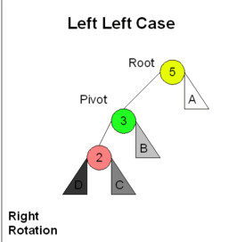
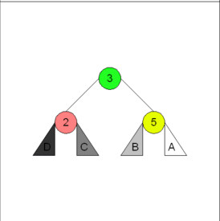
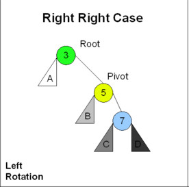
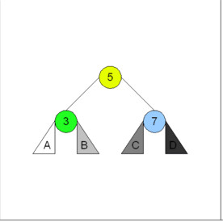
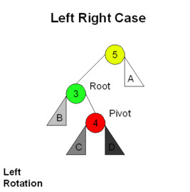
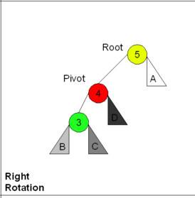
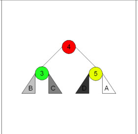
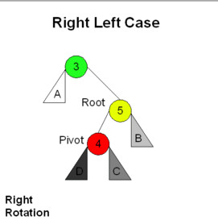
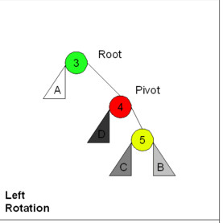
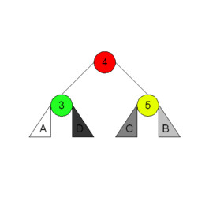

# Árvores Balanceadas

## Árvores Binárias Desbalanceadas

Vamos adicionar os elementos $1, 2, 3, 4, 5, 6, 7$ nessa ordem em uma árvore binária.

## Árvores Binárias Desbalanceadas

\begin{forest}
    rounded/.style={circle, draw},
    [{1}, for tree=rounded
      [,phantom]
      [{2}
        [,phantom]
        [{3}
         [,phantom]
         [{4}
          [,phantom]
          [{5}
           [,phantom]
           [{6}
            [,phantom]
            [{7}
            ]
           ]
          ]
         ]
        ]       
      ]
    ]
\end{forest}

## Árvores Binárias Desbalanceadas

A busca nessa árvore terá o mesmo custo assintótico que a busca sequencial em uma lista linear.

## Árvores Binárias Desbalanceadas

Da mesma forma, vamos adicionar os elementos na ordem reversa!


## Árvores Binárias Desbalanceadas

\begin{forest}
    rounded/.style={circle, draw},
    [{7}, for tree=rounded
      [{6}
        [{5}         
         [{4}          
          [{3}           
           [{2}            
            [{1}]
            [,phantom]
           ]
           [,phantom]
          ]
          [,phantom]
         ]
         [,phantom]
        ]
        [,phantom]       
      ]
      [,phantom]
    ]
\end{forest}

## Árvores Binárias Desbalanceadas

Finalmente, adicionem na ordem $7, 4, 1, 3, 2, 5, 6$.

## Árvores Binárias Desbalanceadas

\begin{forest}
    rounded/.style={circle, draw},
    [{7}, for tree=rounded
     [{4}
       [{1}
         [,phantom]
         [{3}
           [{2}]
           [,phantom]
         ]
       ]
       [{5}
        [,phantom]
        [{6}]
       ]
     ]
     [,phantom]
    ]
\end{forest}

## Árvores Binárias Desbalanceadas

Um pouco melhor, mas ainda distante do que gostaríamos!

## Árvores Binárias Desbalanceadas

As árvores binárias de busca possuem casos degenerados com altura igual a $n-1$.

Nesses casos, as operações tem complexidade $O(n)$ no pior caso.

## Árvores Binárias Desbalanceadas

Uma árvore binária ótima é aquela que minimiza sua altura, ou seja, $\floor*{\log n+1}$.

## Árvores Balanceadas

Uma **árvore balanceada** é uma árvore que automaticamente ajusta a disposição de seus nós para manter uma altura assintótica de $O(\log n)$.

## Exercício

A seguinte árvore está balanceada?

\begin{forest}
rounded/.style={circle, draw},
    [{4}, for tree=rounded
      [{2}
        [{1}]
        [{3}]
      ]
      [{6}
        [{5}]
        [{7}]
      ]
    ]
\end{forest}

## Exercício

A seguinte árvore está balanceada?

\begin{forest}
    rounded/.style={circle, draw},
    [{1}, for tree=rounded
      [,phantom]
      [{2}
        [,phantom]
        [{3}
         [,phantom]
         [{4}
          [,phantom]
          [{5}
           [,phantom]
           [{6}
           ]
          ]
         ]
        ]       
      ]
    ]
\end{forest}

## Exercício

A seguinte árvore está balanceada?

\begin{forest}
rounded/.style={circle, draw},
    [{4}, for tree=rounded
      [{2}
        [{1}]
        [{3}]
      ]
      [{5}
      ]
    ]
\end{forest}

## Árvores Balanceadas

- **Árvores AVL** (Adelson-Velskii e Landis).
- **Árvores Rubro-Negra**.
- **Árvores Splay**.
- **Árvores-B**.

## Árvores AVL

Árvore Balanceada dinâmica (se torna balanceada no momento da inserção/remoção).

## Árvores AVL

1. Condição de balanceamento é de que a altura das sub-árvores de cada nó pode diferir em, no máximo, $1$ unidade.
2. Toda sub-árvore é uma árvore AVL.

## Exercício

Essa é uma árvore AVL?

\begin{forest}
rounded/.style={circle, draw},
    [{5}, for tree=rounded
      [{2}
        [{1}]
        [{4}
          [{3}]
          [,phantom]
        ]
      ]
      [{8}
        [{7}]
        [,phantom]
      ]
    ]
\end{forest}

## Exercício

Essa é uma árvore AVL?

\begin{forest}
rounded/.style={circle, draw},
    [{7}, for tree=rounded
      [{2}
        [{1}]
        [{4}
          [{3}]
          [{5}]
        ]
      ]
      [{8}
      ]
    ]
\end{forest}

## Altura da AVL

Assumindo $n(h)$ como o número mínimo de nós internos em uma árvore AVL de altura $h$.

## Altura da AVL

Temos que $n(0) = 1, n(1) = 2$

## Altura da AVL

Para $h > 1$ temos o nós raíz acrescido dos nós da árvore com altura $h-1$ e $h-2$ (estamos verificando o mínimo de nós).

$$n(h) = 1 + n(h-1) + n(h-2)$$

## Altura da AVL

Sabemos que $n(h-1) > n(h-2)$ e, portanto, $n(h) > 2n(h-2)$, com isso temos que:

$$n(h) > 2n(h-2) > 4n(h-4) > 8n(h-6) > \ldots > 2^{i}n(h-2i)$$

## Altura da AVL

Fazendo $2i = h$ temos:

$n(h) > 2^{h/2}n(0) = 2^{h/2}$

## Altura da AVL

Resolvendo temos:

$h < 2\log{n(h)} = O(log n)$

## Struct da árvore AVL

Vamos alterar um pouco nossa estrutura de árvore para conter informação da altura do nó:

```C
typedef struct tree tree;

struct tree {
  TREE_TYPE x;
  int height;
  struct tree * left;
  struct tree * right;
};

## Inserção na AVL

A inserção ocorre de forma similar a árvore binária de busca:

```C
tree * insert (tree * t, tree * node) {
  
  if (t==NULL) return node;  
  if (node->x < t->x)
      t->left  = insert(t->left , node);
  else if (node->x > t->x) 
      t->right = insert(t->right, node);  
  t->height = MAX( height(t->left), height(t->right) ) 
              + 1;

  return t;
}
```

## Inserção na AVL

O rebalanceamento ocorre logo após uma chamada recursiva de insert, levando a $4$ casos (na verdade dois casos, e os outros dois simétricos):

1. **Esquerda-esquerda:** o nó foi inserido a esquerda do filho esquerdo do nó atual.
2. **Direita-direita:** o nó foi inserido a direita do filho direito do nó atual.
3. **Esquerda-direita:** o nó foi inserido a direita do filho esquerdo do nó atual.
4. **Direita-esquerda:** o nó foi inserido a esquerda do filho direito do nó atual.

## Esquerda-esquerda

Basta fazer uma rotação para a direita utilizando o filho da esquerda como pivô:

{ width=50% }

## Esquerda-esquerda

Basta fazer uma rotação para a direita utilizando o filho da esquerda como pivô:

{ width=50% }

## Direita-direita

Basta fazer uma rotação para a esquerda utilizando o filho da direita como pivô:

{ width=50% }

## Direita-direita

Basta fazer uma rotação para a esquerda utilizando o filho da direita como pivô:

{ width=50% }

## Esquerda-direita

{ width=50% }

## Esquerda-direita

Primeiro fazemos uma rotação para a esquerda:

{ width=50% }

## Esquerda-direita

Em seguida uma rotação para a direita:

{ width=50% }

## Direita-esquerda

{ width=50% }

## Direita-esquerda

Primeiro fazemos uma rotação para a direita:

{ width=50% }

## Direita-esquerda

Em seguida uma rotação para a esquerda:

{ width=50% }

## Inserção na AVL

Dessa forma temos que modificar a inserção para realizar as rotações necessárias.

## Inserção na AVL

```C
tree * insert (tree * t, tree * node) {
  
  if (t==NULL) return node;
  
  if (node->x < t->x) 
  { 
    t->left  = insert(t->left , node);
    if (height(t->left) - height(t->right) == 2)
    {
      if (node->x < t->left->x) t = left_left(t);
      else                      t = left_right(t);
    }
  }
```

## Inserção na AVL
 
```C 
  else if (node->x > t->x) {
    t->right = insert(t->right, node);
    if (height(t->right) - height(t->left) == 2)
    {
      if (node->x > t->right->x) t = right_right(t);
      else                       t = right_left(t);
    }
  }
  
  t->height = calc_height(t);

  return t;
}

```

## Rotação para a Direita

```C
tree * left_left( tree * root ) {
    tree * pivot = root->left;
    root->left = pivot->right;
    pivot->right = root;
 
    root->height = calc_height(root);
    pivot->height = calc_height(pivot);
 
    return pivot;
}
```

## Rotação para a Esquerda

```C
tree * right_right( tree * root ) { 
    tree * pivot = root->right;
    root->right = pivot->left;
    pivot->left = root;
 
    root->height = calc_height(root);
    pivot->height = calc_height(pivot);
 
    return pivot;
}
```

## Rotação Esquerda-Direita

```C
tree * left_right( tree * t ) {
    t->left = right_right( t->left );
    return left_left( t );
}

```

## Rotação Direita-Esquerda

```C
tree * right_left( tree * t ) {
    t->right = left_left( t->right );
    return right_right( t );
}
```

## Passo a passo

Vamos adicionar nós em uma AVL na ordem $7, 4, 1, 3, 2, 5, 6$.

## Passo a passo

\begin{forest}
rounded/.style={circle, draw},
    [{(7,0)}, for tree=rounded]
\end{forest}

## Passo a passo

\begin{forest}
rounded/.style={circle, draw},
    [{(7,1)}, for tree=rounded
      [{(4,0)}]
      [,phantom]
    ]
\end{forest}

## Passo a passo

\begin{forest}
rounded/.style={circle, draw},
    [{(7,2)}, for tree=rounded
      [{(4,1)}
        [{(1,0)}]
        [,phantom]
      ]
      [,phantom]
    ]
\end{forest}

## Passo a passo

\begin{forest}
rounded/.style={circle, draw},
    [{(7,2)}, for tree=rounded
      [{(4,1)}
        [{(1,0)}]
        [,phantom]
      ]
      [,phantom]
    ]
\end{forest}

## Passo a passo

Rotação para direita:

\begin{forest}
rounded/.style={circle, draw},
    [{(4,1)}, for tree=rounded
      [{(1,0)}]
      [{(7,0)}]
    ]
\end{forest}

## Passo a passo

\begin{forest}
rounded/.style={circle, draw},
    [{(4,2)}, for tree=rounded
      [{(1,1)}
        [,phantom]
        [{(3,0)}]
      ]
      [{(7,0)}]
    ]
\end{forest}

## Passo a passo

\begin{forest}
rounded/.style={circle, draw},
    [{(4,3)}, for tree=rounded
      [{(1,2)}
        [,phantom]
        [{(3,1)}
          [{(2,0)}]
          [,phantom]
        ]
      ]
      [{(7,0)}]
    ]
\end{forest}

## Passo a passo

Rotaciona filho direita para direita:

\begin{forest}
rounded/.style={circle, draw},
    [{(4,3)}, for tree=rounded
      [{(1,2)}
        [,phantom]
        [{(2,1)}
          [,phantom]
          [{(3,0)}]          
        ]
      ]
      [{(7,0)}]
    ]
\end{forest}

## Passo a passo

Rotaciona para esquerda:

\begin{forest}
rounded/.style={circle, draw},
    [{(4,2)}, for tree=rounded
      [{(2,1)}
        [{(1,0)}]
        [{(3,0)}]
      ]
      [{(7,0)}]
    ]
\end{forest}

## Passo a passo

\begin{forest}
rounded/.style={circle, draw},
    [{(4,2)}, for tree=rounded
      [{(2,1)}
        [{(1,0)}]
        [{(3,0)}]
      ]
      [{(7,1)}
        [{(5,0)}]
        [,phantom]
      ]
    ]
\end{forest}

## Passo a passo

\begin{forest}
rounded/.style={circle, draw},
    [{(4,3)}, for tree=rounded
      [{(2,1)}
        [{(1,0)}]
        [{(3,0)}]
      ]
      [{(7,2)}
        [{(5,1)}
          [,phantom]
          [{(6,0)}]
        ]
        [,phantom]
      ]
    ]
\end{forest}

## Passo a passo

Rotaciona filho da esquerda para esquerda:

\begin{forest}
rounded/.style={circle, draw},
    [{(4,3)}, for tree=rounded
      [{(2,1)}
        [{(1,0)}]
        [{(3,0)}]
      ]
      [{(7,2)}
        [{(6,1)}          
          [{(5,0)}]
          [,phantom]
        ]
        [,phantom]
      ]
    ]
\end{forest}

## Passo a passo

Rotaciona para direita:

\begin{forest}
rounded/.style={circle, draw},
    [{(4,2)}, for tree=rounded
      [{(2,1)}
        [{(1,0)}]
        [{(3,0)}]
      ]
      [{(6,1)}
        [{(5,0)}]
        [{(7,0)}]
      ]
    ]
\end{forest}

## Passo a passo

Árvore de $7$ nós com altura $2$.

\begin{forest}
rounded/.style={circle, draw},
    [{(4,2)}, for tree=rounded
      [{(2,1)}
        [{(1,0)}]
        [{(3,0)}]
      ]
      [{(6,1)}
        [{(5,0)}]
        [{(7,0)}]
      ]
    ]
\end{forest}

## Vantagens da AVL

- Busca é sempre $O(\log{n})$ pois a árvore está sempre balanceada.
- Inserções e Remoções são sempre $O(\log{n})$.
- O balanceamento adiciona um fator constante nos custos das operações.

## Desvantagens da AVL

- Operações com custo assintótico baixo, mas ainda assim que custam tempo computacional.
- O fator constante da remoção pode ser grande demais.

## Outras árvores balanceadas

- **Árvore Rubro-Negra:** necessita apenas uma rotação por operação, mas não tão balanceada do que a AVL.
- **Árvores-B:** geralmente utilizada para grandes quantidades de dados ou quando esses residem em disco.
- **Splay:** atualiza o balanceamento da árvore durante o acesso ao elemento, operações amortizadas $O(\log{n})$.

## Próxima Aula

Aprenderemos sobre algoritmos de **ordenação** para estruturas lineares.
