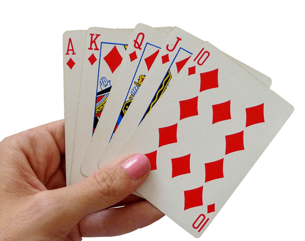

# Algoritmos de Ordenação

## O problema de ordenação

**Ordenação:** *substantivo feminino*, arranjo, distribuição metódica, organizada; ordem.

## O problema de ordenação

**Ordenação (na computação):** organizar registros em ordem ascendente ou descendente.

## O problema de ordenação

- Encontrar registros similares (de acordo com sua chave).
- Rank de pontuação (ex.: Enem, competição, etc.)
- Interseção de arquivos.
- Busca (nossas melhores buscas partiam de registros ordenados).

## O problema de ordenação

Dado um conjunto de registros:

$R_1, R_2, \ldots, R_n$

cada qual com uma chave $K_i$.

## O problema de ordenação

Desejamos encontrar uma permutação $\pi(R)$ tal que:

$K_{\pi(1)} \leq K_{\pi(2)} \leq \ldots \leq K_{\pi(n)}$

## O problema de ordenação

Para isso precisamos estabelecer uma relação binária $(K, \leq)$ de tal forma que seja possível ordenar nosso conjunto.

## Pre-ordem

Essa relação é uma **pré-ordem** se temos as propriedades:

- **Identidade:** para todo $K_i \in K$, $K_i \leq K_i$.
- **Transitividade:** se $K_i \leq K_j$ e $K_j \leq K_l$, então $K_i \leq K_l$.
- **Associatividade:** $(K_i \leq K_j) \leq K_l \implies K_i \leq (K_j \leq K_l)$.

Notem que na pré-ordem podemos ter casos em que um certo $K_i$ não tem relação com um $K_j$. 

## Ordem parcial

Essa relação se torna uma **ordem parcial** ou **poset** (*partially ordered set*) se incluírmos a propriedade:

$K_i \leq K_j, K_j \leq K_i \implies K_i = K_j$

## Poset

\begin{tikzpicture}[font=\ttfamily]
\node[] (coxa) {Coxa};
\node[below left=of coxa] (fabricio) {Fabricio};
\node[below right=of coxa] (paulo) {Paulo};
\node[below right=of fabricio] (cavaleiro) {Cavaleiro};

\draw[->] (fabricio) -- node[below] {$\leq$} (coxa) ;
\draw[->] (paulo) -- node[below] {$\leq$} (coxa) ;
\draw[->] (cavaleiro) -- node[below] {$\leq$} (fabricio) ;
\draw[->] (cavaleiro) -- node[below] {$\leq$} (paulo) ;
\draw[->, dashed] (cavaleiro) -- node[left] {$\leq$} (coxa) ;

\end{tikzpicture}


## Ordem total

Finalmente, a **ordem total** ou **ordem linear** acrescenta:

$\forall K_i, K_j \in K : K_i \leq K_j \lor K_j \leq K_i$

Para nossos algoritmos assumiremos uma ordem total das chaves dos registros.

## O problema de ordenação

O algoritmo de ordenação é dito **estável** se os registros com chaves idênticas mantém sua ordem relativa inicial.

## O problema de ordenação

O algoritmo de ordenação é dito **in-place** se ele ordena sem uso de memória adicional (exceto por uma constante).

## O problema de ordenação

O algoritmo de ordenação é dito **adaptável** se a ordenação atual dos dados influencia a sequência de operações realizadas.

## O problema de ordenação

O algoritmo de ordenação é dito **online** se ele realiza a operação de ordenação enquanto recebe novos elementos.

## O problema de ordenação

Esses algoritmos também podem ser classificados como:

- **Ordenação interna:** quando todos os registros estão armazenados na memória RAM.
- **Ordenação externa:** quando apenas parte dos registros podem ser alocados na memória RAM.

## O problema de ordenação

Os algoritmos de ordenação possuem um limitante em sua complexidade, as classes de algoritmos baseadas em comparação não conseguem ser melhor do que $O(n\cdot \log{n})$, enquanto os algoritmos baseado em contagem podem chegar a $O(n)$ (mas com implicações).

## Exercício

Dado um conjunto de cinco registros $R_1, R_2, R_3, R_4, R_5$ contendo chaves numéricas, escreva um algoritmo para ordenar essas chaves em ordem crescente.

## Exercício

Dado o tempo curto para resolver o problema, as soluções mais prováveis criadas por vocês são:

1. **Insertion sort:** cada item é considerado um de cada vez e inserido em sua posição correta (como você ordena uma mão de baralho).
2. **Exchange sort:** se dois itens estão fora de ordem em relação um ao outro, troca a posição desses.
3. **Selection sort:** encontra o menor valor e insere na posição inicial, depois o segundo menor e assim por diante.
4. **Enumeration sort:** cada item é comparado com todos os outros para determinar sua posição.

## Exercício

5. **Algoritmo específico:** feito com *if-else* exclusivamente para cinco valores.
6. **Preguiçoso:** você ignorou o pedido em fazer o exercício e só esperou a resposta (sinta-se envergonhado!)
7. **Um novo algoritmo melhor que todos os outros existentes:** saia imediatamente da aula e vá escrever um artigo!

## O problema de ordenação

Existem diversos algoritmos de ordenação, e não existe um algoritmo supremo!

Cada algoritmo possui vantagens em relação a outros dependendo da situação. É importante conhecer tais características para escolher o algoritmo que irá utilizar.

## Tipos de Algoritmos de Ordenação

Os algoritmos de ordenação podem ser agrupados como (em itálico os algoritmos que aprenderemos no curso):

- **Contagem:** counting sort.
- **Inserção:** *insertion sort*, binary insertion sort, shellsort.
- **Troca:** *bubble sort*, *quick sort*.
- **Seleção:** *selection sort*, *heap sort*.
- **Mistura:** *merge sort*
- **Distribuição:** radix sort, *bucket sort*.

## Base dos algoritmos de ordenação

Vamos supor uma estrutura de registro com uma chave e um campo de dados:

```C
typedef struct registro {
    int key;
    int data;
} registro;
```

## Base dos algoritmos de ordenação

Todo algoritmo de ordenação terá a seguinte assinatura de função:

```C
void sort(registro *base, int n);
```

No laboratório vamos ver como deixar o algoritmo genérico para qualquer estrutura.

# Algoritmos Simples

## Algoritmos Simples

Na aula de hoje iremos aprender sobre três algoritmos simples, e ineficientes de ordenação: **insertion sort**, **bubble sort** e **selection sort**.

## Insertion Sort

Talvez a ideia mais trivial é a de ordenar os elementos assim como ordenamos uma mão de cartas de baralho.



## Insertion Sort

Parte da premissa que se os elementos de $0$ a $k-1$ já estão ordenados, o próximo passo consiste em mover o elemento $k$ para sua posição correta.

## Insertion Sort

Para $k = 1$, temos que a lista até $k-1$ possui um único elemento, e ela está ordenada!

\begin{tikzpicture}[font=\ttfamily,
array/.style={matrix of nodes,nodes={draw, minimum size=7mm, fill=green!30},column sep=-\pgflinewidth, row sep=0.5mm, nodes in empty cells,
row 1/.style={nodes={draw=none, fill=none, minimum size=5mm}},
},ampersand replacement=\&]

\matrix[array] (array) {
0 \& 1 \& 2 \& 3 \& 4 \& 5 \& 6 \& 7 \& 8 \\
88 \& 56 \& 100 \& 2 \& 25 \& 32 \& 1  \& 99  \& 21  \\};

\begin{scope}[on background layer]
\fill[green!10] (array-1-1.north west) rectangle (array-1-9.south east);
\end{scope}

\draw (array-1-1.north)--++(90:3mm) node [above] (first) {$k-1$};
\draw (array-1-2.north)--++(90:3mm) node [above] (first) {$k$};

\end{tikzpicture}

## Insertion Sort

Ao inserir o elemento $k$ na posição correta, temos que a lista de $0$ a $k$ agora está ordenada!

\begin{tikzpicture}[font=\ttfamily,
array/.style={matrix of nodes,nodes={draw, minimum size=7mm, fill=green!30},column sep=-\pgflinewidth, row sep=0.5mm, nodes in empty cells,
row 1/.style={nodes={draw=none, fill=none, minimum size=5mm}},
},ampersand replacement=\&]

\matrix[array] (array) {
0 \& 1 \& 2 \& 3 \& 4 \& 5 \& 6 \& 7 \& 8 \\
56 \& 88 \& 100 \& 2 \& 25 \& 32 \& 1  \& 99  \& 21  \\};

\begin{scope}[on background layer]
\fill[green!10] (array-1-1.north west) rectangle (array-1-9.south east);
\end{scope}

\draw (array-1-1.north)--++(90:3mm) node [above] (first) {$k-1$};
\draw (array-1-2.north)--++(90:3mm) node [above] (first) {$k$};

\end{tikzpicture}

## Insertion Sort

Repetimos para $k=2$.

\begin{tikzpicture}[font=\ttfamily,
array/.style={matrix of nodes,nodes={draw, minimum size=7mm, fill=green!30},column sep=-\pgflinewidth, row sep=0.5mm, nodes in empty cells,
row 1/.style={nodes={draw=none, fill=none, minimum size=5mm}},
},ampersand replacement=\&]

\matrix[array] (array) {
0 \& 1 \& 2 \& 3 \& 4 \& 5 \& 6 \& 7 \& 8 \\
56 \& 88 \& 100 \& 2 \& 25 \& 32 \& 1  \& 99  \& 21  \\};

\begin{scope}[on background layer]
\fill[green!10] (array-1-1.north west) rectangle (array-1-9.south east);
\end{scope}

\draw (array-1-2.north)--++(90:3mm) node [above] (first) {$k-1$};
\draw (array-1-3.north)--++(90:3mm) node [above] (first) {$k$};

\end{tikzpicture}

Nada a fazer!

## Insertion Sort

Repetimos para $k=3$.

\begin{tikzpicture}[font=\ttfamily,
array/.style={matrix of nodes,nodes={draw, minimum size=7mm, fill=green!30},column sep=-\pgflinewidth, row sep=0.5mm, nodes in empty cells,
row 1/.style={nodes={draw=none, fill=none, minimum size=5mm}},
},ampersand replacement=\&]

\matrix[array] (array) {
0 \& 1 \& 2 \& 3 \& 4 \& 5 \& 6 \& 7 \& 8 \\
56 \& 88 \& 100 \& 2 \& 25 \& 32 \& 1  \& 99  \& 21  \\};

\begin{scope}[on background layer]
\fill[green!10] (array-1-1.north west) rectangle (array-1-9.south east);
\end{scope}

\draw (array-1-3.north)--++(90:3mm) node [above] (first) {$k-1$};
\draw (array-1-4.north)--++(90:3mm) node [above] (first) {$k$};

\end{tikzpicture}

Qual procedimento utilizar?

## Insertion Sort

Basta começar de $i=k-1$ e fazer a troca entre os elementos $i$ e $i+1$ caso $K_i > K_{i+1}$. Ao encontrar um caso falso, pare! (Por que?)

## Insertion Sort

Com esse procedimento, temos que fazer três atribuições por movimento (o `swap`). Podemos melhorar!

## Insertion Sort

Armazenamos o registro $i+1$ em uma variável e simplesmente movemos uma casa para direita todo registro $i = k-1 \ldots 0$ cuja chave seja maior que a chave armazenada.

## Insertion Sort

```C
void insert(registro *base, int k) {
      registro x = base[k];
      --k;
      
      while (k >= 0 && base[k].key > x.key)
      {
          base[k+1] = base[k];
          --k;
      }
      base[k+1] = x;
}

```

## Insertion Sort

Repetimos para $k=3$. Guardamos o registro com chave $2$ e movemos os elementos maiores para direita.

\begin{tikzpicture}[font=\ttfamily,
array/.style={matrix of nodes,nodes={draw, minimum size=7mm, fill=green!30},column sep=-\pgflinewidth, row sep=0.5mm, nodes in empty cells,
row 1/.style={nodes={draw=none, fill=none, minimum size=5mm}},
},ampersand replacement=\&]

\matrix[array] (array) {
0 \& 1 \& 2 \& 3 \& 4 \& 5 \& 6 \& 7 \& 8 \\
56 \& 88 \& 100 \& 2 \& 25 \& 32 \& 1  \& 99  \& 21  \\};


\matrix[array, below=of array] (temp) {
2 \\};

\begin{scope}[on background layer]
\fill[green!10] (array-1-1.north west) rectangle (array-1-9.south east);
\end{scope}

\draw (array-1-4.north)--++(90:3mm) node [above] (first) {$k$};

\end{tikzpicture}

## Insertion Sort

Repetimos para $k=3$. Guardamos o registro com chave $2$ e movemos os elementos maiores para direita.

\begin{tikzpicture}[font=\ttfamily,
array/.style={matrix of nodes,nodes={draw, minimum size=7mm, fill=green!30},column sep=-\pgflinewidth, row sep=0.5mm, nodes in empty cells,
row 1/.style={nodes={draw=none, fill=none, minimum size=5mm}},
},ampersand replacement=\&]

\matrix[array] (array) {
0 \& 1 \& 2 \& 3 \& 4 \& 5 \& 6 \& 7 \& 8 \\
56 \& 88 \& 100 \& 100 \& 25 \& 32 \& 1  \& 99  \& 21  \\};


\matrix[array, below=of array] (temp) {
2 \\};

\begin{scope}[on background layer]
\fill[green!10] (array-1-1.north west) rectangle (array-1-9.south east);
\end{scope}

\draw (array-1-3.north)--++(90:3mm) node [above] (first) {$k$};

\end{tikzpicture}

## Insertion Sort

Repetimos para $k=3$. Guardamos o registro com chave $2$ e movemos os elementos maiores para direita.

\begin{tikzpicture}[font=\ttfamily,
array/.style={matrix of nodes,nodes={draw, minimum size=7mm, fill=green!30},column sep=-\pgflinewidth, row sep=0.5mm, nodes in empty cells,
row 1/.style={nodes={draw=none, fill=none, minimum size=5mm}},
},ampersand replacement=\&]

\matrix[array] (array) {
0 \& 1 \& 2 \& 3 \& 4 \& 5 \& 6 \& 7 \& 8 \\
56 \& 88 \& 88 \& 100 \& 25 \& 32 \& 1  \& 99  \& 21  \\};


\matrix[array, below=of array] (temp) {
2 \\};

\begin{scope}[on background layer]
\fill[green!10] (array-1-1.north west) rectangle (array-1-9.south east);
\end{scope}

\draw (array-1-2.north)--++(90:3mm) node [above] (first) {$k$};

\end{tikzpicture}

## Insertion Sort

Repetimos para $k=3$. Guardamos o registro com chave $2$ e movemos os elementos maiores para direita.

\begin{tikzpicture}[font=\ttfamily,
array/.style={matrix of nodes,nodes={draw, minimum size=7mm, fill=green!30},column sep=-\pgflinewidth, row sep=0.5mm, nodes in empty cells,
row 1/.style={nodes={draw=none, fill=none, minimum size=5mm}},
},ampersand replacement=\&]

\matrix[array] (array) {
0 \& 1 \& 2 \& 3 \& 4 \& 5 \& 6 \& 7 \& 8 \\
56 \& 56 \& 88 \& 100 \& 25 \& 32 \& 1  \& 99  \& 21  \\};


\matrix[array, below=of array] (temp) {
2 \\};

\begin{scope}[on background layer]
\fill[green!10] (array-1-1.north west) rectangle (array-1-9.south east);
\end{scope}

\draw (array-1-1.north)--++(90:3mm) node [above] (first) {$k$};

\end{tikzpicture}

## Insertion Sort

Repetimos para $k=3$. Guardamos o registro com chave $2$ e movemos os elementos maiores para direita.

\begin{tikzpicture}[font=\ttfamily,
array/.style={matrix of nodes,nodes={draw, minimum size=7mm, fill=green!30},column sep=-\pgflinewidth, row sep=0.5mm, nodes in empty cells,
row 1/.style={nodes={draw=none, fill=none, minimum size=5mm}},
},ampersand replacement=\&]

\matrix[array] (array) {
0 \& 1 \& 2 \& 3 \& 4 \& 5 \& 6 \& 7 \& 8 \\
2 \& 56 \& 88 \& 100 \& 25 \& 32 \& 1  \& 99  \& 21  \\};


\matrix[array, below=of array] (temp) {
2 \\};

\begin{scope}[on background layer]
\fill[green!10] (array-1-1.north west) rectangle (array-1-9.south east);
\end{scope}

\draw (array-1-1.north)--++(90:3mm) node [above] (first) {$k$};

\end{tikzpicture}

## Insertion Sort

Com essa operação bem definida, o algoritmo de ordenação **Insertion Sort** é a repetição desse movimento iniciando em $k=1$ até $n$:

```C
void insertionSort(registro *base, int n) {
    int k = 1;
    
    while (k < n)
    {
      insert(base, k);
      ++k;
    }
}
```

## Insertion Sort

\begin{tabular}{lr}
\toprule
 & Insert \\
 \midrule
estável & \checkmark \\
in-place & \checkmark  \\
online &  \checkmark \\
adaptivo & \checkmark \\
\bottomrule
\end{tabular}

## Complexidade Assintótica

Para cada um dos $n$ elementos precisamos fazer até $k$ operações, com isso esse algoritmo tem complexidade $O(k \cdot n)$. Mas quanto é o valor de $k$?

## Complexidade Assintótica

No melhor, os registros já estão ordenados, então não temos que fazer nada e $k=1$, temos então uma complexidade $O(n)$.

## Complexidade Assintótica

No pior, temos os registros em ordem inversa, então temos que os valores de $k$ seguem a sequência $1, 2, 3, \ldots, n$. Com isso temos:

$\sum_{k=1}^{n}{k} = \frac{n \cdot (n+1)}{2}$

Ou seja, no pior temos complexidade $O(n^2)$.

## Complexidade Assintótica

No médio, vamos imaginar uma variável $x_{ij}$ que tem valor $1$ caso $K_i > K_j$ e, portanto, o elemento $i$ será movido para direita, e $0$, caso contrário.

## Complexidade Assintótica

Precisamos descobrir o valor esperado da somatória de todos os pares $i,j$ para determinar quantas trocas faremos em média:

$m = E[\sum{x_{ij}}] = \sum_{E[x_{ij}]} = \sum_{\frac{1}{2}} = \frac{n \cdot (n+1)}{4}$

Ou seja, temos um médio $O(n^2)$.

## Complexidade Assintótica

O algoritmo Insertion Sort é mais rápido do que muitos algoritmos de menor complexidade para os casos em que:

- A lista já está quase ordenada.
- A lista é pequena (o quão pequena depende do processador, compilador e outros fatores, uma regra do dedão diz que $n=10$).

## Complexidade Assintótica

\begin{tabular}{lr}
\toprule
 & Insertion \\
 \midrule
melhor & $O(n)$ \\
pior & $O(n^2)$  \\
médio & $O(n^2)$ \\
\bottomrule
\end{tabular}

## Bubble Sort

No algoritmo Insertion Sort, pegamos um elemento e *afundamos* ele até seu lugar na parte mais baixa de nossa `array`.

Uma outra estratégia simples é pegar cada elemento e *flutuarmos* ele até seu lugar na parte mais alta, essa estratégia é conhecida como **Bubble Sort**.

## Bubble Sort

Basicamente, o algoritmo pode ser descrito em sua forma mais abstrata como:

```C
void bubbleSort(registro *base, int n) {
    while (bubbleUp(base, n));
}
```

## Bubble Sort

A cada passo da repetição, trocamos (`swap`) cada elemento $i$ pelo seu vizinho $i+1$ caso eles estejam desordenados.

## Bubble Sort

```C
char bubbleUp(registro *base, int n) {
    char changed = 0;
    for (int i=0; i<n-1; i++)
    {
        if (base[i].key > base[i+1].key)
        {
            swap(base+i, base+i+1);
            changed = 1;
        }
    }
    return changed;
}
```

## Bubble Sort

\begin{tikzpicture}[font=\ttfamily,
array/.style={matrix of nodes,nodes={draw, minimum size=7mm, fill=green!30},column sep=-\pgflinewidth, row sep=0.5mm, nodes in empty cells,
row 1/.style={nodes={draw=none, fill=none, minimum size=5mm}},
},ampersand replacement=\&]

\matrix[array] (array) {
0 \& 1 \& 2 \& 3 \& 4 \& 5 \& 6 \& 7 \& 8 \\
88 \& 56 \& 100 \& 2 \& 25 \& 32 \& 1  \& 99  \& 21  \\};

\begin{scope}[on background layer]
\fill[green!10] (array-1-1.north west) rectangle (array-1-9.south east);
\end{scope}

\draw (array-1-1.north)--++(90:3mm) node [above] (first) {$i$};
\draw (array-1-2.north)--++(90:3mm) node [above] (first) {$i+1$};

\end{tikzpicture}

## Bubble Sort

\begin{tikzpicture}[font=\ttfamily,
array/.style={matrix of nodes,nodes={draw, minimum size=7mm, fill=green!30},column sep=-\pgflinewidth, row sep=0.5mm, nodes in empty cells,
row 1/.style={nodes={draw=none, fill=none, minimum size=5mm}},
},ampersand replacement=\&]

\matrix[array] (array) {
0 \& 1 \& 2 \& 3 \& 4 \& 5 \& 6 \& 7 \& 8 \\
56 \& 88 \& 100 \& 2 \& 25 \& 32 \& 1  \& 99  \& 21  \\};

\begin{scope}[on background layer]
\fill[green!10] (array-1-1.north west) rectangle (array-1-9.south east);
\end{scope}

\draw (array-1-2.north)--++(90:3mm) node [above] (first) {$i$};
\draw (array-1-3.north)--++(90:3mm) node [above] (first) {$i+1$};

\end{tikzpicture}

## Bubble Sort

\begin{tikzpicture}[font=\ttfamily,
array/.style={matrix of nodes,nodes={draw, minimum size=7mm, fill=green!30},column sep=-\pgflinewidth, row sep=0.5mm, nodes in empty cells,
row 1/.style={nodes={draw=none, fill=none, minimum size=5mm}},
},ampersand replacement=\&]

\matrix[array] (array) {
0 \& 1 \& 2 \& 3 \& 4 \& 5 \& 6 \& 7 \& 8 \\
56 \& 88 \& 100 \& 2 \& 25 \& 32 \& 1  \& 99  \& 21  \\};

\begin{scope}[on background layer]
\fill[green!10] (array-1-1.north west) rectangle (array-1-9.south east);
\end{scope}

\draw (array-1-3.north)--++(90:3mm) node [above] (first) {$i$};
\draw (array-1-4.north)--++(90:3mm) node [above] (first) {$i+1$};

\end{tikzpicture}

## Bubble Sort

\begin{tikzpicture}[font=\ttfamily,
array/.style={matrix of nodes,nodes={draw, minimum size=7mm, fill=green!30},column sep=-\pgflinewidth, row sep=0.5mm, nodes in empty cells,
row 1/.style={nodes={draw=none, fill=none, minimum size=5mm}},
},ampersand replacement=\&]

\matrix[array] (array) {
0 \& 1 \& 2 \& 3 \& 4 \& 5 \& 6 \& 7 \& 8 \\
56 \& 88 \& 2 \& 100 \& 25 \& 32 \& 1  \& 99  \& 21  \\};

\begin{scope}[on background layer]
\fill[green!10] (array-1-1.north west) rectangle (array-1-9.south east);
\end{scope}

\draw (array-1-4.north)--++(90:3mm) node [above] (first) {$i$};
\draw (array-1-5.north)--++(90:3mm) node [above] (first) {$i+1$};

\end{tikzpicture}

## Bubble Sort

\begin{tikzpicture}[font=\ttfamily,
array/.style={matrix of nodes,nodes={draw, minimum size=7mm, fill=green!30},column sep=-\pgflinewidth, row sep=0.5mm, nodes in empty cells,
row 1/.style={nodes={draw=none, fill=none, minimum size=5mm}},
},ampersand replacement=\&]

\matrix[array] (array) {
0 \& 1 \& 2 \& 3 \& 4 \& 5 \& 6 \& 7 \& 8 \\
56 \& 88 \& 2 \& 25 \& 100 \& 32 \& 1  \& 99  \& 21  \\};

\begin{scope}[on background layer]
\fill[green!10] (array-1-1.north west) rectangle (array-1-9.south east);
\end{scope}

\draw (array-1-5.north)--++(90:3mm) node [above] (first) {$i$};
\draw (array-1-6.north)--++(90:3mm) node [above] (first) {$i+1$};

\end{tikzpicture}

## Bubble Sort

\begin{tikzpicture}[font=\ttfamily,
array/.style={matrix of nodes,nodes={draw, minimum size=7mm, fill=green!30},column sep=-\pgflinewidth, row sep=0.5mm, nodes in empty cells,
row 1/.style={nodes={draw=none, fill=none, minimum size=5mm}},
},ampersand replacement=\&]

\matrix[array] (array) {
0 \& 1 \& 2 \& 3 \& 4 \& 5 \& 6 \& 7 \& 8 \\
56 \& 88 \& 2 \& 25 \& 32 \& 100 \& 1  \& 99  \& 21  \\};

\begin{scope}[on background layer]
\fill[green!10] (array-1-1.north west) rectangle (array-1-9.south east);
\end{scope}

\draw (array-1-6.north)--++(90:3mm) node [above] (first) {$i$};
\draw (array-1-7.north)--++(90:3mm) node [above] (first) {$i+1$};

\end{tikzpicture}

## Bubble Sort

\begin{tikzpicture}[font=\ttfamily,
array/.style={matrix of nodes,nodes={draw, minimum size=7mm, fill=green!30},column sep=-\pgflinewidth, row sep=0.5mm, nodes in empty cells,
row 1/.style={nodes={draw=none, fill=none, minimum size=5mm}},
},ampersand replacement=\&]

\matrix[array] (array) {
0 \& 1 \& 2 \& 3 \& 4 \& 5 \& 6 \& 7 \& 8 \\
56 \& 88 \& 2 \& 25 \& 32 \& 1 \& 100  \& 99  \& 21  \\};

\begin{scope}[on background layer]
\fill[green!10] (array-1-1.north west) rectangle (array-1-9.south east);
\end{scope}

\draw (array-1-7.north)--++(90:3mm) node [above] (first) {$i$};
\draw (array-1-8.north)--++(90:3mm) node [above] (first) {$i+1$};

\end{tikzpicture}

## Bubble Sort

\begin{tikzpicture}[font=\ttfamily,
array/.style={matrix of nodes,nodes={draw, minimum size=7mm, fill=green!30},column sep=-\pgflinewidth, row sep=0.5mm, nodes in empty cells,
row 1/.style={nodes={draw=none, fill=none, minimum size=5mm}},
},ampersand replacement=\&]

\matrix[array] (array) {
0 \& 1 \& 2 \& 3 \& 4 \& 5 \& 6 \& 7 \& 8 \\
56 \& 88 \& 2 \& 25 \& 32 \& 1 \& 99  \& 100  \& 21  \\};

\begin{scope}[on background layer]
\fill[green!10] (array-1-1.north west) rectangle (array-1-9.south east);
\end{scope}

\draw (array-1-8.north)--++(90:3mm) node [above] (first) {$i$};
\draw (array-1-9.north)--++(90:3mm) node [above] (first) {$i+1$};

\end{tikzpicture}

## Bubble Sort

\begin{tikzpicture}[font=\ttfamily,
array/.style={matrix of nodes,nodes={draw, minimum size=7mm, fill=green!30},column sep=-\pgflinewidth, row sep=0.5mm, nodes in empty cells,
row 1/.style={nodes={draw=none, fill=none, minimum size=5mm}},
},ampersand replacement=\&]

\matrix[array] (array) {
0 \& 1 \& 2 \& 3 \& 4 \& 5 \& 6 \& 7 \& 8 \\
56 \& 88 \& 2 \& 25 \& 32 \& 1 \& 99  \& 21  \& 100  \\};

\begin{scope}[on background layer]
\fill[green!10] (array-1-1.north west) rectangle (array-1-9.south east);
\end{scope}

\end{tikzpicture}

## Bubble Sort

Otimização: note que a função `bubbleUp` sempre deixa o último elemento na posição correta, portanto não precisamos fazer as comparações dos elementos já ordenados. A cada passo $i$, verificamos apenas até $n-i$.

## Bubble Sort

\begin{tabular}{lrr}
\toprule
 & Insert & Bubble \\
\midrule
estável & \checkmark & \checkmark \\
in-place & \checkmark  & \checkmark \\
online &  \checkmark & \\
adaptivo & \checkmark & \checkmark \\
\bottomrule
\end{tabular}

## Complexidade Assintótica

\begin{tabular}{lrr}
\toprule
 & Insert & Bubble \\
 \midrule
melhor & $O(n)$ & $O(n)$ \\
pior & $O(n^2)$  & $O(n^2)$ \\
médio & $O(n^2)$ & $O(n^2)$ \\
\bottomrule
\end{tabular}

## Selection Sort

Um outro algoritmo simples de ordenação é o **Selection Sort**, a ideia é simplesmente repetir a busca pelo menor elemento da lista, e colocá-lo na $i$-ésima posição, depedendo da iteração.

## Selection Sort

```C
void selectionSort(registro *base, int n) {
    int i, j, i_min;
    
    for (j=0; j<n-1; j++)
    {
        i_min = find_min(base + j, n-j) + j;
        if (i_min != j) swap(base+i_min, base+j);
    }
}
```

## Selection Sort

\begin{tikzpicture}[font=\ttfamily,
array/.style={matrix of nodes,nodes={draw, minimum size=7mm, fill=green!30},column sep=-\pgflinewidth, row sep=0.5mm, nodes in empty cells,
row 1/.style={nodes={draw=none, fill=none, minimum size=5mm}},
},ampersand replacement=\&]

\matrix[array] (array) {
0 \& 1 \& 2 \& 3 \& 4 \& 5 \& 6 \& 7 \& 8 \\
88 \& 56 \& 100 \& 2 \& 25 \& 32 \& 1  \& 99  \& 21  \\};

\begin{scope}[on background layer]
\fill[green!10] (array-1-1.north west) rectangle (array-1-9.south east);
\end{scope}

\draw (array-1-1.north)--++(90:3mm) node [above] (first) {$j$};

\end{tikzpicture}

## Selection Sort

\begin{tikzpicture}[font=\ttfamily,
array/.style={matrix of nodes,nodes={draw, minimum size=7mm, fill=green!30},column sep=-\pgflinewidth, row sep=0.5mm, nodes in empty cells,
row 1/.style={nodes={draw=none, fill=none, minimum size=5mm}},
},ampersand replacement=\&]

\matrix[array] (array) {
0 \& 1 \& 2 \& 3 \& 4 \& 5 \& 6 \& 7 \& 8 \\
1 \& 56 \& 100 \& 2 \& 25 \& 32 \& 88  \& 99  \& 21  \\};

\begin{scope}[on background layer]
\fill[green!10] (array-1-1.north west) rectangle (array-1-9.south east);
\end{scope}

\draw (array-1-2.north)--++(90:3mm) node [above] (first) {$j$};

\end{tikzpicture}

## Selection Sort

\begin{tikzpicture}[font=\ttfamily,
array/.style={matrix of nodes,nodes={draw, minimum size=7mm, fill=green!30},column sep=-\pgflinewidth, row sep=0.5mm, nodes in empty cells,
row 1/.style={nodes={draw=none, fill=none, minimum size=5mm}},
},ampersand replacement=\&]

\matrix[array] (array) {
0 \& 1 \& 2 \& 3 \& 4 \& 5 \& 6 \& 7 \& 8 \\
1 \& 2 \& 100 \& 56 \& 25 \& 32 \& 88  \& 99  \& 21  \\};

\begin{scope}[on background layer]
\fill[green!10] (array-1-1.north west) rectangle (array-1-9.south east);
\end{scope}

\draw (array-1-3.north)--++(90:3mm) node [above] (first) {$j$};

\end{tikzpicture}

## Selection Sort

\begin{tikzpicture}[font=\ttfamily,
array/.style={matrix of nodes,nodes={draw, minimum size=7mm, fill=green!30},column sep=-\pgflinewidth, row sep=0.5mm, nodes in empty cells,
row 1/.style={nodes={draw=none, fill=none, minimum size=5mm}},
},ampersand replacement=\&]

\matrix[array] (array) {
0 \& 1 \& 2 \& 3 \& 4 \& 5 \& 6 \& 7 \& 8 \\
1 \& 2 \& 21 \& 56 \& 25 \& 32 \& 88  \& 99  \& 100  \\};

\begin{scope}[on background layer]
\fill[green!10] (array-1-1.north west) rectangle (array-1-9.south east);
\end{scope}

\draw (array-1-4.north)--++(90:3mm) node [above] (first) {$j$};

\end{tikzpicture}

## Selection Sort

\begin{tikzpicture}[font=\ttfamily,
array/.style={matrix of nodes,nodes={draw, minimum size=7mm, fill=green!30},column sep=-\pgflinewidth, row sep=0.5mm, nodes in empty cells,
row 1/.style={nodes={draw=none, fill=none, minimum size=5mm}},
},ampersand replacement=\&]

\matrix[array] (array) {
0 \& 1 \& 2 \& 3 \& 4 \& 5 \& 6 \& 7 \& 8 \\
1 \& 2 \& 21 \& 25 \& 56 \& 32 \& 88  \& 99  \& 100  \\};

\begin{scope}[on background layer]
\fill[green!10] (array-1-1.north west) rectangle (array-1-9.south east);
\end{scope}

\draw (array-1-5.north)--++(90:3mm) node [above] (first) {$j$};

\end{tikzpicture}

## Selection Sort

\begin{tikzpicture}[font=\ttfamily,
array/.style={matrix of nodes,nodes={draw, minimum size=7mm, fill=green!30},column sep=-\pgflinewidth, row sep=0.5mm, nodes in empty cells,
row 1/.style={nodes={draw=none, fill=none, minimum size=5mm}},
},ampersand replacement=\&]

\matrix[array] (array) {
0 \& 1 \& 2 \& 3 \& 4 \& 5 \& 6 \& 7 \& 8 \\
1 \& 2 \& 21 \& 25 \& 32 \& 56 \& 88  \& 99  \& 100  \\};

\begin{scope}[on background layer]
\fill[green!10] (array-1-1.north west) rectangle (array-1-9.south east);
\end{scope}

\draw (array-1-6.north)--++(90:3mm) node [above] (first) {$j$};

\end{tikzpicture}

## Selection Sort

\begin{tikzpicture}[font=\ttfamily,
array/.style={matrix of nodes,nodes={draw, minimum size=7mm, fill=green!30},column sep=-\pgflinewidth, row sep=0.5mm, nodes in empty cells,
row 1/.style={nodes={draw=none, fill=none, minimum size=5mm}},
},ampersand replacement=\&]

\matrix[array] (array) {
0 \& 1 \& 2 \& 3 \& 4 \& 5 \& 6 \& 7 \& 8 \\
1 \& 2 \& 21 \& 25 \& 32 \& 56 \& 88  \& 99  \& 100  \\};

\begin{scope}[on background layer]
\fill[green!10] (array-1-1.north west) rectangle (array-1-9.south east);
\end{scope}

\draw (array-1-7.north)--++(90:3mm) node [above] (first) {$j$};

\end{tikzpicture}

## Selection Sort

\begin{tikzpicture}[font=\ttfamily,
array/.style={matrix of nodes,nodes={draw, minimum size=7mm, fill=green!30},column sep=-\pgflinewidth, row sep=0.5mm, nodes in empty cells,
row 1/.style={nodes={draw=none, fill=none, minimum size=5mm}},
},ampersand replacement=\&]

\matrix[array] (array) {
0 \& 1 \& 2 \& 3 \& 4 \& 5 \& 6 \& 7 \& 8 \\
1 \& 2 \& 21 \& 25 \& 32 \& 56 \& 88  \& 99  \& 100  \\};

\begin{scope}[on background layer]
\fill[green!10] (array-1-1.north west) rectangle (array-1-9.south east);
\end{scope}

\draw (array-1-8.north)--++(90:3mm) node [above] (first) {$j$};

\end{tikzpicture}

## Selection Sort

\begin{tikzpicture}[font=\ttfamily,
array/.style={matrix of nodes,nodes={draw, minimum size=7mm, fill=green!30},column sep=-\pgflinewidth, row sep=0.5mm, nodes in empty cells,
row 1/.style={nodes={draw=none, fill=none, minimum size=5mm}},
},ampersand replacement=\&]

\matrix[array] (array) {
0 \& 1 \& 2 \& 3 \& 4 \& 5 \& 6 \& 7 \& 8 \\
1 \& 2 \& 21 \& 25 \& 32 \& 56 \& 88  \& 99  \& 100  \\};

\begin{scope}[on background layer]
\fill[green!10] (array-1-1.north west) rectangle (array-1-9.south east);
\end{scope}

\draw (array-1-9.north)--++(90:3mm) node [above] (first) {$j$};

\end{tikzpicture}

## Selection Sort

\begin{tabular}{lrrr}
\toprule
 & Insert & Bubble & Select  \\
\midrule
estável & \checkmark & \checkmark & \\
in-place & \checkmark  & \checkmark & \checkmark \\
online &  \checkmark & & \\
adaptivo & \checkmark & \checkmark &\\
\bottomrule
\end{tabular}

## Exercício

Verifique a estabilidade do Selection Sort para a sequência $4, 2, 3, 4, 1$.

## Complexidade Assintótica

\begin{tabular}{lrrr}
\toprule
 & Insert & Bubble & Select  \\
 \midrule
melhor & $O(n)$ & $O(n)$ & $O(n^2)$ \\
pior & $O(n^2)$  & $O(n^2)$ & $O(n^2)$  \\
médio & $O(n^2)$ & $O(n^2)$ & $O(n^2)$  \\
\bottomrule
\end{tabular}

## Próxima aula

Na próxima aula aprenderemos os algoritmos **quick sort** e **merge sort**.


