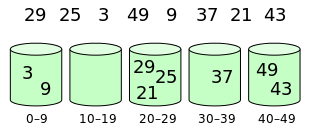

# Algoritmos de Ordenação Eficientes

## Heap Sort

Na primeira aula de ordenação aprendemos sobre o Selection Sort. A limitação desse algoritmo estava justamente na busca pelo menor valor, que sempre demandava $n$ comparações, levando a uma complexidade $O(n^2)$.

## Heap Sort

E se pudessemos encontrar o menor ou maior valor de uma lista de forma eficiente?

## Heap Sort

Isso é possível utilizando a árvore **Max-Heap**!

## Max-Heap

Uma Max-Heap é uma árvore binária completa, ou seja, todos os seus níves, exceto o último, possuem todos os nós. Além disso, no último nível os nós estão sempre a esquerda.

## Max-Heap

Um outro pré-requisito é que:

$pai(i) > i$

para todos os nós $i$.

## Max-Heap

Com isso garantimos que a raiz da árvore **sempre** conterá o maior elemento.


## Max-Heap

\begin{forest}
rounded/.style={circle, draw},
    [{100}, for tree=rounded
      [{88}
        [{51}
          [{1}]
          [{20}]
        ]
        [{23}]
      ]
      [{67}
        [{2}]
        [{30}]
      ]
    ]
\end{forest}

## Max-Heap

Essa não é uma max-heap!

\begin{forest}
rounded/.style={circle, draw},
    [{88}, for tree=rounded
      [{100}
        [{51}
          [{1}]
          [{20}]
        ]
        [{23}]
      ]
      [{67}
        [{2}]
        [{30}]
      ]
    ]
\end{forest}


## Max-Heap

Essa não é uma max-heap!

\begin{forest}
rounded/.style={circle, draw},
    [{100}, for tree=rounded
      [{88}
        [{51}]
        [{23}]
      ]
      [{67}
        [{2}
          [{1}]
          [{20}]
        ]
        [{30}]
      ]
    ]
\end{forest}

## Max-Heap

Por ser uma árvore binária completa, podemos representá-la em forma de array de tal forma que:

- $right(i) = 2*i + 1$
- $left(i) = 2*i + 2$

## Max-Heap

Para transformar uma lista em uma Max-Heap, devemos aplicar um algoritmo de *reparação* da metade até o começo.

## Max-Heap

Esse algoritmo verificar se um certo nó está na posição correta, caso não esteja, move ele para baixo até atingir uma posição que satisfaça as condições do Max-Heap.

## Max-Heap

```C
void max_heapify(registro *base, int node, int n) {
    int left = 2*node + 1,right = 2*node + 2;
    int largest = node;
    if (left<n && base[left].key > base[largest].key]) 
        largest = left;
    if (right <n && base[right].key > base[largest].key]) 
        largest = right;
        
    if (largest != node)
    {
        swap(base+node, base+largest);
        max_heapify(base, largest, n);
    }
}
```

## Heapify

\begin{tikzpicture}[font=\ttfamily,
array/.style={matrix of nodes,nodes={draw, minimum size=7mm, fill=green!30},column sep=-\pgflinewidth, row sep=0.5mm, nodes in empty cells,
row 1/.style={nodes={draw=none, fill=none, minimum size=5mm}},
},ampersand replacement=\&]

\matrix[array] (array) {
0 \& 1 \& 2 \& 3 \& 4 \& 5 \& 6 \& 7 \& 8 \\
88 \& 56 \& 100 \& 2 \& 25 \& 32 \& 1  \& 99  \& 21  \\};

\begin{scope}[on background layer]
\fill[green!10] (array-1-1.north west) rectangle (array-1-9.south east);
\fill[red!10] (array-2-1.north west) rectangle (array-2-1.south east);
\end{scope}

\draw (array-1-4.north)--++(90:3mm) node [above] (first) {$node$};
\draw (array-1-8.north)--++(90:3mm) node [above] (first) {$left$};
\draw (array-1-9.north)--++(90:3mm) node [above] (first) {$right$};

\end{tikzpicture}

## Heapify

\begin{tikzpicture}[font=\ttfamily,
array/.style={matrix of nodes,nodes={draw, minimum size=7mm, fill=green!30},column sep=-\pgflinewidth, row sep=0.5mm, nodes in empty cells,
row 1/.style={nodes={draw=none, fill=none, minimum size=5mm}},
},ampersand replacement=\&]

\matrix[array] (array) {
0 \& 1 \& 2 \& 3 \& 4 \& 5 \& 6 \& 7 \& 8 \\
88 \& 56 \& 100 \& 99 \& 25 \& 32 \& 1  \& 2  \& 21  \\};

\begin{scope}[on background layer]
\fill[green!10] (array-1-1.north west) rectangle (array-1-9.south east);
\fill[red!10] (array-2-1.north west) rectangle (array-2-1.south east);
\end{scope}

\draw (array-1-3.north)--++(90:3mm) node [above] (first) {$node$};
\draw (array-1-6.north)--++(90:3mm) node [above] (first) {$left$};
\draw (array-1-7.north)--++(90:3mm) node [above] (first) {$right$};

\end{tikzpicture}

## Heapify

\begin{tikzpicture}[font=\ttfamily,
array/.style={matrix of nodes,nodes={draw, minimum size=7mm, fill=green!30},column sep=-\pgflinewidth, row sep=0.5mm, nodes in empty cells,
row 1/.style={nodes={draw=none, fill=none, minimum size=5mm}},
},ampersand replacement=\&]

\matrix[array] (array) {
0 \& 1 \& 2 \& 3 \& 4 \& 5 \& 6 \& 7 \& 8 \\
88 \& 56 \& 100 \& 99 \& 25 \& 32 \& 1  \& 2  \& 21  \\};

\begin{scope}[on background layer]
\fill[green!10] (array-1-1.north west) rectangle (array-1-9.south east);
\fill[red!10] (array-2-1.north west) rectangle (array-2-1.south east);
\end{scope}

\draw (array-1-2.north)--++(90:3mm) node [above] (first) {$node$};
\draw (array-1-4.north)--++(90:3mm) node [above] (first) {$left$};
\draw (array-1-5.north)--++(90:3mm) node [above] (first) {$right$};

\end{tikzpicture}

## Heapify

\begin{tikzpicture}[font=\ttfamily,
array/.style={matrix of nodes,nodes={draw, minimum size=7mm, fill=green!30},column sep=-\pgflinewidth, row sep=0.5mm, nodes in empty cells,
row 1/.style={nodes={draw=none, fill=none, minimum size=5mm}},
},ampersand replacement=\&]

\matrix[array] (array) {
0 \& 1 \& 2 \& 3 \& 4 \& 5 \& 6 \& 7 \& 8 \\
88 \& 99 \& 100 \& 56 \& 25 \& 32 \& 1  \& 2  \& 21  \\};

\begin{scope}[on background layer]
\fill[green!10] (array-1-1.north west) rectangle (array-1-9.south east);
\fill[red!10] (array-2-1.north west) rectangle (array-2-1.south east);
\end{scope}

\draw (array-1-4.north)--++(90:3mm) node [above] (first) {$node$};
\draw (array-1-8.north)--++(90:3mm) node [above] (first) {$left$};
\draw (array-1-9.north)--++(90:3mm) node [above] (first) {$right$};

\end{tikzpicture}

## Heapify

\begin{tikzpicture}[font=\ttfamily,
array/.style={matrix of nodes,nodes={draw, minimum size=7mm, fill=green!30},column sep=-\pgflinewidth, row sep=0.5mm, nodes in empty cells,
row 1/.style={nodes={draw=none, fill=none, minimum size=5mm}},
},ampersand replacement=\&]

\matrix[array] (array) {
0 \& 1 \& 2 \& 3 \& 4 \& 5 \& 6 \& 7 \& 8 \\
88 \& 99 \& 100 \& 56 \& 25 \& 32 \& 1  \& 2  \& 21  \\};

\begin{scope}[on background layer]
\fill[green!10] (array-1-1.north west) rectangle (array-1-9.south east);
\fill[red!10] (array-2-1.north west) rectangle (array-2-1.south east);
\end{scope}

\draw (array-1-1.north)--++(90:3mm) node [above] (first) {$node$};
\draw (array-1-2.north)--++(90:3mm) node [above] (first) {$left$};
\draw (array-1-3.north)--++(90:3mm) node [above] (first) {$right$};

\end{tikzpicture}

## Heapify

\begin{tikzpicture}[font=\ttfamily,
array/.style={matrix of nodes,nodes={draw, minimum size=7mm, fill=green!30},column sep=-\pgflinewidth, row sep=0.5mm, nodes in empty cells,
row 1/.style={nodes={draw=none, fill=none, minimum size=5mm}},
},ampersand replacement=\&]

\matrix[array] (array) {
0 \& 1 \& 2 \& 3 \& 4 \& 5 \& 6 \& 7 \& 8 \\
100 \& 99 \& 88 \& 56 \& 25 \& 32 \& 1  \& 2  \& 21  \\};

\begin{scope}[on background layer]
\fill[green!10] (array-1-1.north west) rectangle (array-1-9.south east);
\fill[red!10] (array-2-1.north west) rectangle (array-2-1.south east);
\end{scope}

\draw (array-1-3.north)--++(90:3mm) node [above] (first) {$node$};
\draw (array-1-6.north)--++(90:3mm) node [above] (first) {$left$};
\draw (array-1-7.north)--++(90:3mm) node [above] (first) {$right$};

\end{tikzpicture}

## Heapify

\begin{forest}
rounded/.style={circle, draw},
    [{100}, for tree=rounded
      [{99}
        [{56}
          [{2}]
          [{21}]
        ]
        [{25}
        ]
      ]
      [{88}
        [{32}]
        [{1}]
      ]
    ]
\end{forest}

## Heap Sort

Com isso, basta repetir $n$ vezes o procedimento:

- Troca o primeiro elemento pelo último (o último está na posição correta)
- Reduz $n$ em $1$
- Aplica `heapify` na raiz

## Heap Sort

```C
void heapSort(registro *base, int n) {
    for (int i=n/2-1; i>=0; i--) 
        max_heapify(base, i, n);

    for (int i=n-1; i>0; i--)
    {
        swap(base, base+i);
        --n;
        max_heapify(base, 0, n);
    }
    
}
```

## Heap Sort

\begin{tikzpicture}[font=\ttfamily,
array/.style={matrix of nodes,nodes={draw, minimum size=7mm, fill=green!30},column sep=-\pgflinewidth, row sep=0.5mm, nodes in empty cells,
row 1/.style={nodes={draw=none, fill=none, minimum size=5mm}},
},ampersand replacement=\&]

\matrix[array] (array) {
0 \& 1 \& 2 \& 3 \& 4 \& 5 \& 6 \& 7 \& 8 \\
100 \& 99 \& 88 \& 56 \& 25 \& 32 \& 1  \& 2  \& 21  \\};

\begin{scope}[on background layer]
\fill[green!10] (array-1-1.north west) rectangle (array-1-9.south east);
\end{scope}

\draw (array-1-9.north)--++(90:3mm) node [above] (first) {$n$};

\end{tikzpicture}

\begin{forest}
rounded/.style={circle, draw},
    [{100}, for tree=rounded
      [{99}
        [{56}
          [{2}]
          [{21}]
        ]
        [{25}
        ]
      ]
      [{88}
        [{32}]
        [{1}]
      ]
    ]
\end{forest}

## Heap Sort

\begin{tikzpicture}[font=\ttfamily,
array/.style={matrix of nodes,nodes={draw, minimum size=7mm, fill=green!30},column sep=-\pgflinewidth, row sep=0.5mm, nodes in empty cells,
row 1/.style={nodes={draw=none, fill=none, minimum size=5mm}},
},ampersand replacement=\&]

\matrix[array] (array) {
0 \& 1 \& 2 \& 3 \& 4 \& 5 \& 6 \& 7 \& 8 \\
21 \& 99 \& 88 \& 56 \& 25 \& 32 \& 1  \& 2  \& 100  \\};

\begin{scope}[on background layer]
\fill[green!10] (array-1-1.north west) rectangle (array-1-9.south east);
\end{scope}

\draw (array-1-8.north)--++(90:3mm) node [above] (first) {$n$};

\end{tikzpicture}

\begin{forest}
rounded/.style={circle, draw},
    [{21}, for tree=rounded
      [{99}
        [{56}
          [{2}]          
        ]
        [{25}
        ]
      ]
      [{88}
        [{32}]
        [{1}]
      ]
    ]
\end{forest}

## Heap Sort

\begin{tikzpicture}[font=\ttfamily,
array/.style={matrix of nodes,nodes={draw, minimum size=7mm, fill=green!30},column sep=-\pgflinewidth, row sep=0.5mm, nodes in empty cells,
row 1/.style={nodes={draw=none, fill=none, minimum size=5mm}},
},ampersand replacement=\&]

\matrix[array] (array) {
0 \& 1 \& 2 \& 3 \& 4 \& 5 \& 6 \& 7 \& 8 \\
99 \& 56 \& 88 \& 21 \& 25 \& 32 \& 1  \& 2  \& 100  \\};

\begin{scope}[on background layer]
\fill[green!10] (array-1-1.north west) rectangle (array-1-9.south east);
\end{scope}

\draw (array-1-8.north)--++(90:3mm) node [above] (first) {$n$};

\end{tikzpicture}

\begin{forest}
rounded/.style={circle, draw},
    [{99}, for tree=rounded
      [{56}
        [{21}
          [{2}]          
        ]
        [{25}
        ]
      ]
      [{88}
        [{32}]
        [{1}]
      ]
    ]
\end{forest}

## Heap Sort

\begin{tikzpicture}[font=\ttfamily,
array/.style={matrix of nodes,nodes={draw, minimum size=7mm, fill=green!30},column sep=-\pgflinewidth, row sep=0.5mm, nodes in empty cells,
row 1/.style={nodes={draw=none, fill=none, minimum size=5mm}},
},ampersand replacement=\&]

\matrix[array] (array) {
0 \& 1 \& 2 \& 3 \& 4 \& 5 \& 6 \& 7 \& 8 \\
2 \& 56 \& 88 \& 21 \& 25 \& 32 \& 1  \& 99  \& 100  \\};

\begin{scope}[on background layer]
\fill[green!10] (array-1-1.north west) rectangle (array-1-9.south east);
\end{scope}

\draw (array-1-7.north)--++(90:3mm) node [above] (first) {$n$};

\end{tikzpicture}

\begin{forest}
rounded/.style={circle, draw},
    [{2}, for tree=rounded
      [{56}
        [{21}]
        [{25}
        ]
      ]
      [{88}
        [{32}]
        [{1}]
      ]
    ]
\end{forest}

## Heap Sort

\begin{tikzpicture}[font=\ttfamily,
array/.style={matrix of nodes,nodes={draw, minimum size=7mm, fill=green!30},column sep=-\pgflinewidth, row sep=0.5mm, nodes in empty cells,
row 1/.style={nodes={draw=none, fill=none, minimum size=5mm}},
},ampersand replacement=\&]

\matrix[array] (array) {
0 \& 1 \& 2 \& 3 \& 4 \& 5 \& 6 \& 7 \& 8 \\
88 \& 56 \& 32 \& 21 \& 25 \& 2 \& 1  \& 99  \& 100  \\};

\begin{scope}[on background layer]
\fill[green!10] (array-1-1.north west) rectangle (array-1-9.south east);
\end{scope}

\draw (array-1-7.north)--++(90:3mm) node [above] (first) {$n$};

\end{tikzpicture}

\begin{forest}
rounded/.style={circle, draw},
    [{88}, for tree=rounded
      [{56}
        [{21}]
        [{25}
        ]
      ]
      [{32}
        [{2}]
        [{1}]
      ]
    ]
\end{forest}

## Heap Sort

\begin{tikzpicture}[font=\ttfamily,
array/.style={matrix of nodes,nodes={draw, minimum size=7mm, fill=green!30},column sep=-\pgflinewidth, row sep=0.5mm, nodes in empty cells,
row 1/.style={nodes={draw=none, fill=none, minimum size=5mm}},
},ampersand replacement=\&]

\matrix[array] (array) {
0 \& 1 \& 2 \& 3 \& 4 \& 5 \& 6 \& 7 \& 8 \\
1 \& 56 \& 32 \& 21 \& 25 \& 2 \& 88  \& 99  \& 100  \\};

\begin{scope}[on background layer]
\fill[green!10] (array-1-1.north west) rectangle (array-1-9.south east);
\end{scope}

\draw (array-1-6.north)--++(90:3mm) node [above] (first) {$n$};

\end{tikzpicture}

\begin{forest}
rounded/.style={circle, draw},
    [{1}, for tree=rounded
      [{56}
        [{21}]
        [{25}
        ]
      ]
      [{32}
        [{2}]
      ]
    ]
\end{forest}

## Heap Sort

\begin{tikzpicture}[font=\ttfamily,
array/.style={matrix of nodes,nodes={draw, minimum size=7mm, fill=green!30},column sep=-\pgflinewidth, row sep=0.5mm, nodes in empty cells,
row 1/.style={nodes={draw=none, fill=none, minimum size=5mm}},
},ampersand replacement=\&]

\matrix[array] (array) {
0 \& 1 \& 2 \& 3 \& 4 \& 5 \& 6 \& 7 \& 8 \\
56 \& 25 \& 32 \& 21 \& 1 \& 2 \& 88  \& 99  \& 100  \\};

\begin{scope}[on background layer]
\fill[green!10] (array-1-1.north west) rectangle (array-1-9.south east);
\end{scope}

\draw (array-1-6.north)--++(90:3mm) node [above] (first) {$n$};

\end{tikzpicture}

\begin{forest}
rounded/.style={circle, draw},
    [{56}, for tree=rounded
      [{25}
        [{21}]
        [{1}]
      ]
      [{32}
        [{2}]
      ]
    ]
\end{forest}

## Heap Sort

\begin{tikzpicture}[font=\ttfamily,
array/.style={matrix of nodes,nodes={draw, minimum size=7mm, fill=green!30},column sep=-\pgflinewidth, row sep=0.5mm, nodes in empty cells,
row 1/.style={nodes={draw=none, fill=none, minimum size=5mm}},
},ampersand replacement=\&]

\matrix[array] (array) {
0 \& 1 \& 2 \& 3 \& 4 \& 5 \& 6 \& 7 \& 8 \\
2 \& 25 \& 32 \& 21 \& 1 \& 56 \& 88  \& 99  \& 100  \\};

\begin{scope}[on background layer]
\fill[green!10] (array-1-1.north west) rectangle (array-1-9.south east);
\end{scope}

\draw (array-1-5.north)--++(90:3mm) node [above] (first) {$n$};

\end{tikzpicture}

\begin{forest}
rounded/.style={circle, draw},
    [{2}, for tree=rounded
      [{25}
        [{21}]
        [{1}]
      ]
      [{32}]
    ]
\end{forest}

## Heap Sort

\begin{tikzpicture}[font=\ttfamily,
array/.style={matrix of nodes,nodes={draw, minimum size=7mm, fill=green!30},column sep=-\pgflinewidth, row sep=0.5mm, nodes in empty cells,
row 1/.style={nodes={draw=none, fill=none, minimum size=5mm}},
},ampersand replacement=\&]

\matrix[array] (array) {
0 \& 1 \& 2 \& 3 \& 4 \& 5 \& 6 \& 7 \& 8 \\
32 \& 25 \& 2 \& 21 \& 1 \& 56 \& 88  \& 99  \& 100  \\};

\begin{scope}[on background layer]
\fill[green!10] (array-1-1.north west) rectangle (array-1-9.south east);
\end{scope}

\draw (array-1-5.north)--++(90:3mm) node [above] (first) {$n$};

\end{tikzpicture}

\begin{forest}
rounded/.style={circle, draw},
    [{32}, for tree=rounded
      [{25}
        [{21}]
        [{1}]
      ]
      [{2}]
    ]
\end{forest}

## Heap Sort

\begin{tikzpicture}[font=\ttfamily,
array/.style={matrix of nodes,nodes={draw, minimum size=7mm, fill=green!30},column sep=-\pgflinewidth, row sep=0.5mm, nodes in empty cells,
row 1/.style={nodes={draw=none, fill=none, minimum size=5mm}},
},ampersand replacement=\&]

\matrix[array] (array) {
0 \& 1 \& 2 \& 3 \& 4 \& 5 \& 6 \& 7 \& 8 \\
1 \& 25 \& 2 \& 21 \& 32 \& 56 \& 88  \& 99  \& 100  \\};

\begin{scope}[on background layer]
\fill[green!10] (array-1-1.north west) rectangle (array-1-9.south east);
\end{scope}

\draw (array-1-4.north)--++(90:3mm) node [above] (first) {$n$};

\end{tikzpicture}

\begin{forest}
rounded/.style={circle, draw},
    [{1}, for tree=rounded
      [{25}
        [{21}]
      ]
      [{2}]
    ]
\end{forest}

## Heap Sort

\begin{tikzpicture}[font=\ttfamily,
array/.style={matrix of nodes,nodes={draw, minimum size=7mm, fill=green!30},column sep=-\pgflinewidth, row sep=0.5mm, nodes in empty cells,
row 1/.style={nodes={draw=none, fill=none, minimum size=5mm}},
},ampersand replacement=\&]

\matrix[array] (array) {
0 \& 1 \& 2 \& 3 \& 4 \& 5 \& 6 \& 7 \& 8 \\
25 \& 21 \& 2 \& 1 \& 32 \& 56 \& 88  \& 99  \& 100  \\};

\begin{scope}[on background layer]
\fill[green!10] (array-1-1.north west) rectangle (array-1-9.south east);
\end{scope}

\draw (array-1-4.north)--++(90:3mm) node [above] (first) {$n$};

\end{tikzpicture}

\begin{forest}
rounded/.style={circle, draw},
    [{25}, for tree=rounded
      [{21}
        [{1}]
      ]
      [{2}]
    ]
\end{forest}

## Heap Sort

\begin{tikzpicture}[font=\ttfamily,
array/.style={matrix of nodes,nodes={draw, minimum size=7mm, fill=green!30},column sep=-\pgflinewidth, row sep=0.5mm, nodes in empty cells,
row 1/.style={nodes={draw=none, fill=none, minimum size=5mm}},
},ampersand replacement=\&]

\matrix[array] (array) {
0 \& 1 \& 2 \& 3 \& 4 \& 5 \& 6 \& 7 \& 8 \\
1 \& 21 \& 2 \& 25 \& 32 \& 56 \& 88  \& 99  \& 100  \\};

\begin{scope}[on background layer]
\fill[green!10] (array-1-1.north west) rectangle (array-1-9.south east);
\end{scope}

\draw (array-1-3.north)--++(90:3mm) node [above] (first) {$n$};

\end{tikzpicture}

\begin{forest}
rounded/.style={circle, draw},
    [{1}, for tree=rounded
      [{21}]
      [{2}]
    ]
\end{forest}

## Heap Sort

\begin{tikzpicture}[font=\ttfamily,
array/.style={matrix of nodes,nodes={draw, minimum size=7mm, fill=green!30},column sep=-\pgflinewidth, row sep=0.5mm, nodes in empty cells,
row 1/.style={nodes={draw=none, fill=none, minimum size=5mm}},
},ampersand replacement=\&]

\matrix[array] (array) {
0 \& 1 \& 2 \& 3 \& 4 \& 5 \& 6 \& 7 \& 8 \\
21 \& 1 \& 2 \& 25 \& 32 \& 56 \& 88  \& 99  \& 100  \\};

\begin{scope}[on background layer]
\fill[green!10] (array-1-1.north west) rectangle (array-1-9.south east);
\end{scope}

\draw (array-1-3.north)--++(90:3mm) node [above] (first) {$n$};

\end{tikzpicture}

\begin{forest}
rounded/.style={circle, draw},
    [{21}, for tree=rounded
      [{1}]
      [{2}]
    ]
\end{forest}

## Heap Sort

\begin{tikzpicture}[font=\ttfamily,
array/.style={matrix of nodes,nodes={draw, minimum size=7mm, fill=green!30},column sep=-\pgflinewidth, row sep=0.5mm, nodes in empty cells,
row 1/.style={nodes={draw=none, fill=none, minimum size=5mm}},
},ampersand replacement=\&]

\matrix[array] (array) {
0 \& 1 \& 2 \& 3 \& 4 \& 5 \& 6 \& 7 \& 8 \\
2 \& 1 \& 21 \& 25 \& 32 \& 56 \& 88  \& 99  \& 100  \\};

\begin{scope}[on background layer]
\fill[green!10] (array-1-1.north west) rectangle (array-1-9.south east);
\end{scope}

\draw (array-1-2.north)--++(90:3mm) node [above] (first) {$n$};

\end{tikzpicture}

\begin{forest}
rounded/.style={circle, draw},
    [{2}, for tree=rounded
      [{1}]
    ]
\end{forest}

## Heap Sort

\begin{tikzpicture}[font=\ttfamily,
array/.style={matrix of nodes,nodes={draw, minimum size=7mm, fill=green!30},column sep=-\pgflinewidth, row sep=0.5mm, nodes in empty cells,
row 1/.style={nodes={draw=none, fill=none, minimum size=5mm}},
},ampersand replacement=\&]

\matrix[array] (array) {
0 \& 1 \& 2 \& 3 \& 4 \& 5 \& 6 \& 7 \& 8 \\
1 \& 2 \& 21 \& 25 \& 32 \& 56 \& 88  \& 99  \& 100  \\};

\begin{scope}[on background layer]
\fill[green!10] (array-1-1.north west) rectangle (array-1-9.south east);
\end{scope}

\draw (array-1-1.north)--++(90:3mm) node [above] (first) {$n$};

\end{tikzpicture}

## Heap Sort

\begin{tabular}{lrrrrrr}
\toprule
 & Insert & Bubble & Select & Quick & Merge & Heap  \\
\midrule
estável & \checkmark & \checkmark & & & \checkmark &  \\
in-place & \checkmark  & \checkmark & \checkmark & \checkmark & & \checkmark\\
online &  \checkmark & & & & & \\
adaptivo & \checkmark & \checkmark & & & & \\
\bottomrule
\end{tabular}

## Complexidade Assintótica

Cada chamada de `heapify` tem complexidade $O(\log{n})$, esse procedimento é chamado $n$ vezes, sendo assim temos complexidade $O(n \log{n})$ em todos os casos.


## Complexidade Assintótica

\scriptsize
\begin{tabular}{lrrrrrr}
\toprule
 & Insert & Bubble & Select & Quick & Merge & Heap \\
 \midrule
melhor & $O(n)$ & $O(n)$ & $O(n^2)$ & $O(n \log{n})$ & $O(n \log{n})$ & $O(n \log{n})$\\
pior & $O(n^2)$  & $O(n^2)$ & $O(n^2)$ & $O(n^2)$ & $O(n \log{n})$ & $O(n \log{n})$\\
médio & $O(n^2)$ & $O(n^2)$ & $O(n^2)$  & $O(n \log{n})$ & $O(n \log{n})$ & $O(n \log{n})$\\
\bottomrule
\end{tabular}


## Bucket Sort

Até então os melhores algoritmos tem um melhor caso de $O(n\log{n})$, podemos fazer melhor?

## Bucket Sort

Em casos específicos em que: 

- Os dados estão bem distribuídos
- Sabemos a faixa de valores

Podemos construir um algoritmo com complexidade $O(n)$.

## Bucket Sort

Um desses algoritmos é chamado **Bucket Sort**. A ideia geral é criar $k$ baldes sendo que cada balde representa uma faixa de valores.

## Bucket Sort

Para cada registro da lista, insere ele no balde correspondente.



## Bucket Sort

No caso de cada balde conter apenas um registro, basta retirá-los na ordem dos baldes e eles estarão ordenados.

## Bucket Sort

Caso contrário, basta ordenar os registros dentro de cada balde e depois desempacotá-los.


## Bucket Sort

A quantidade de operações para colocar cada registro dentro do balde é na ordem de $O(n)$.

Para retirá-los, também $O(n)$.

A ordenação, podemos utilizar Insertion Sort que, para poucos elementos e quase ordenados, tem custo $O(k\cdot n)$.

## Bucket Sort

```C
void bucketSort(registro *base, int n, int n_buckets) {
    info ** buckets = malloc(sizeof(info *)*n_buckets);
    registro * x = malloc(sizeof(registro)*n);
    int k, j, M=base[0].key;
    
    for (int i=1; i<n; i++) M = MAX(base[i].key, M);
```

## Bucket Sort

```C
    /* coloca no balde */
    for (int i=0; i<n; i++)
    {
        k = floor((float)base[i].key / M * 
                     (n_buckets-1));
        buckets[k] = insere_fim(buckets[k], i);
    }
```

## Bucket Sort

```C
    /* remove do balde e ordena */
    k=0; j=0;
    for (int i=0; i<n_buckets; i++)
    {
        while (buckets[i]!=NULL)
        {
            x[k] = base[buckets[i]->x];
            buckets[i] = buckets[i]->prox;
            ++k;
        }
        insertionSort(x + j, k - j);
        j = k;        
    }
   	    
    memcpy(base, x, sizeof(registro)*n);
}
```

## Bucket Sort

\scriptsize
\begin{tabular}{lrrrrrrr}
\toprule
 & Insert & Bubble & Select & Quick & Merge & Heap & Bucket \\
\midrule
estável & \checkmark & \checkmark & & & \checkmark & &  \\
in-place & \checkmark  & \checkmark & \checkmark & \checkmark & & \checkmark &  \\
online &  \checkmark & & & & & & \\
adaptivo & \checkmark & \checkmark & & & & & \\
\bottomrule
\end{tabular}

## Complexidade Assintótica

Apesar de o melhor caso e caso médio a complexidade ser da ordem de $O(n)$, no pior caso temos que todos os elementos são alocados para um único balde e, nesse caso, a complexidade é a mesma do Insertion Sort, $O(n^2)$.

Uma análise cuidadosa dos dados pode evitar o pior caso.

## Complexidade Assintótica

\scriptsize
\begin{tabular}{lrrrrrrr}
\toprule
 & Insert & Bubble & Select & Quick & Merge & Heap & Bucket \\
 \midrule
melhor & $O(n)$ & $O(n)$ & $O(n^2)$ & $O(n \log{n})$ & $O(n \log{n})$ & $O(n \log{n})$ & $O(n)$ \\
pior & $O(n^2)$  & $O(n^2)$ & $O(n^2)$ & $O(n^2)$ & $O(n \log{n})$ & $O(n \log{n})$ & $O(n^2)$\\
médio & $O(n^2)$ & $O(n^2)$ & $O(n^2)$  & $O(n \log{n})$ & $O(n \log{n})$ & $O(n \log{n})$ & $O(n)$\\
\bottomrule
\end{tabular}


## Limites da ordenação por comparação

Considere o algoritmo que determine o maior valor entre dois números:

```C
int maior(int x, int y) {
    if (x>y) return x;
    return y;
}
```

## Limites da ordenação por comparação

E se quisermos adaptar para três números?

```C
int maior(int x, int y, int z) {
    if (x>y)
    {
       if (x>z) return x;
       return z;
    } else {
       if (y>z) return y;
       return z;
    }
}
```

## Limites da ordenação por comparação

Quantas comparações precisamos fazer para $n$ elementos?

## Limites da ordenação por comparação

Podemos representar isso como uma árvore de comparações (vamos alterar nosso problema para ordenação):

\begin{forest}
    rounded/.style={circle, draw},
    squared/.style={rectangle,draw}
    [{1:2}, for tree=rounded
      [{2:3}
        [{1:2:3}, squared]
        [{1:3}
           [{1:3:2}, squared]
           [{3:1:2}, squared]
        ]
      ]
      [{2:3}
        [{1:3}
          [{2:1:3}, squared]
          [{2:3:1}, squared]
        ]
        [{3:2:1}, squared]
      ]
    ]
\end{forest}

## Limites da ordenação por comparação

Cada nó externo dessa árvore representa uma permutação dos elementos de uma lista, e cada nó interno uma comparação feita para ganhar informação.

## Limites da ordenação por comparação

Com isso segue que temos $n!$ nós externos em uma árvore que ordena $n$ elementos sem redundância. Sendo essa uma árvore binária, temos então um limitante em $O(\log{n!})$ comparações.

## Limites da ordenação por comparação

Sabemos que:

$n! = 1 \cdot 2 \cdot \ldots \cdot n$

e

$\log{1 \cdot 2 \cdot \ldots \cdot n} = \log{1} + \log{2} + \ldots + \log{n}$

## Limites da ordenação por comparação

Como estamos fazendo uma análise assintótica, podemos dizer que $O(\log{n!}) = O(n \log{n})$.

Ou seja, os algoritmos de comparação estão limitados nessa ordem de complexidade.
